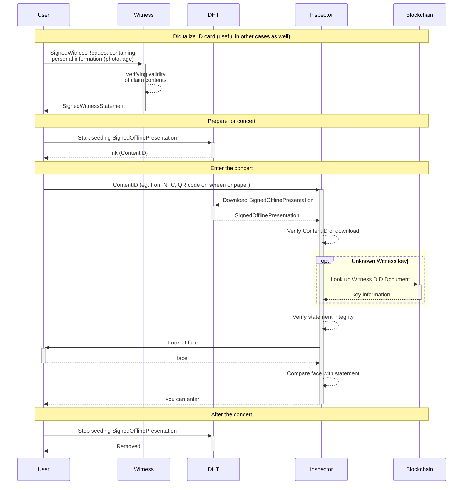

# Claim Presentation Use Cases

## Terminology

We assume that the reader has a basic understanding of 
- [asymmetric cryptography](https://en.wikipedia.org/wiki/Public-key_cryptography) including public and private keys
- digital signatures and [hash functions](https://en.wikipedia.org/wiki/Hash_function).

### Entity

A unique, real life actor such as a person, IoT device, company, group of people, etc. that a system wants to distinguish

### Persona

An aspect of personal life a user wants to keep separated. Real life people might have multiple identities/roles depending on their life situations, such as "dating persona" and/or "dayjob persona". A persona is also an entity.

### KeyId

A key identifier deterministically derived from a public key, e.g. a Bitcoin address. The derivation process must be irreversible, so that the public key cannot be guessed from the key identifier. To achieve this, derivations usually apply hashing functions.

### DID

All entities can generate a decentralized identifier, a DID. Starting from a private/public keypair owned by an entity, a related DID is derived as the key identifier of the public key.

The Prometheus KeyVault derives the public Keys for DID generation under the "morpheus" subtree.
> I'm still not convinced here [name=Bartmoss]

The purpose of a DID is to reason about identity (in the mathematical sense of "being the same") over time, even when the keys used by an entity are replaced. It is decentralized so
  - each entity alone can create any number of owned DIDs.
  - there is no communication needed among entities to make sure each DID is unique.
  - owners can prove that the DID belongs to them, without verifiers getting this capability.

### Proof of DID Control

To proof control over a DID, an entity has to prove control over a private key with the correct authorization by signing a one-time object (e.g. a Signable Request or a Signable Statement). The validation then happens by verifying the signature and then looking up the relevant DID document and making sure the key used has the correct rights.

> This feels very rough currently. We need to define rules of rights management[name=Amon Engemann]

TODO define matching against KeyId instead of public key.

### DID Document

The DID document is publicly shareable data, that does NOT contain any private information, but contains permission management via keys. The document can use the `"services"` field to refer to service endpoints that have additional information about the entity represented by the DID.

```json
# Example
{
  "@context": "https://iop.global/did/v1",
  "did": "did:morpheus:ezFoo",
  "keys": [{
    "@id": "did:morpheus:ezFoo#key-1",
    "type": "Ed25519PublicKey",
    "controller": "did:morpheus:ezFoo"
    "bytes": "pezFoo",
    "addedHeight": 504784,
    "revokedHeight": 516501,
  }, {
    "@id": "did:morpheus:ezFoo#key-2",
    "type": "Ed25519KeyId",
    "controller": "did:morpheus:ezBar",
    "bytes": "iezBaz",
    "addedHeight": 514586,
    "revokedHeight": null,
  }...],
  // BIG TBD
  "rights": {
    "impersonate": [
      "#key-1", "#key-2"
    ],
    "update_did": [
      "#key-1"
    ]
  },
  // end of TBD
  "services": [{
    "id": 0,
    "type": "mercuryAddress",
    "url": "iez..."  
  }, {
    "id": 1,
    "type": "website",
    "url": "http://www.example.org"
  } ... ]
}
```


TBD: The `"services"` object could also be used to link to a revocation list, an API endpoint that returns a list of all statements signed by this entity that have been revoked.

Where

- `@context` defines the DID document format.
- `keys` is strictly ordered and append only. The key itself at a specific index might be changed though.
- `keys.controller` identifies the controller of the corresponding private key.

### Implicit (Throw Away) DID Document

Some minimalistic use cases might simply need signatures and simple authorization tokens, but don't need support for multiple devices, organizational structures with delegates and other advanced rights management features. 
To make these cases simpler and cheaper, we do not always require registering a DID on a blockchain. When there's no explicitly registered DID document found, the implicit Document below is returned.
```json
{
  "@context": "https://iop.global/did/v1",
  "did": "did:morpheus:ezSomething",
  "keys": [{
    "@id": "did:morpheus:ezSomething#key-0",
    "type": "Multicipher",
    "key": {
      "display": "iezSomething",
      "??": "KeyIDv1", <-- TBD
      "cipherSuite": "Ed25519",
      "base": "base58-btc",
      "hex": "01afaf01202af...",
    }
  }],
  // BIG TBD
  "rights": {
    "impersonate": ["#key-0"],
    "update_did": ["#key-0"],
    ... // all possible rights
  },
  // end of TBD
  "services": []
}
```

TODO define multicipher somewhere around and refer to it from here
TODO clarify and finish this explanation

In other words, anyone - able to create signatures with a public key that the DID (as KeyId) can be derived from - has total control over this DID, thus can impersonate and add new keys, but that requires registering these changes on the ledger.

### Witness

An attestant entity that has given its digital signature to some claims. Using a DID, witnesses are able to change the cryptographic keys they use for signing statements over time.

### Authority

A company, state government or any other certificate provider entity that is trusted by many to be a reliable witness. Also, an authority might delegate signing claims to any number of witnesses, which act on behalf of the authority in certain respects. Delegations may be granted or revoked over time.

### Inspector

Another company, individual or any service provider entity that wants to verify the validity of a claim, presented by the subject in the form of a statement from a witness that is deemed trustworthy by the inspector. For example, an inspector can be a conductor, an event gatekeeper, a bartender, etc.

### Verifier

A service provider entity (might be conflated with the inspector) that is verifying the validity of a signature by looking up DID documents and comparing access rights. 
*Verifier does not see any private information only cryptographical hashes, signatures and stuff.*

### Content ID

Irreversible transformation of data into a shorter number.
  - Different data will be provably hashed to different numbers in practical applications.
  - Knowing only the hash of a data you cannot guess the data itself.
  - Knowing both the hash and the data you cannot create a different data that hashes to the same number.

### Claim

A set of data that contains information about a subject entity.

```json
# Example
{
  "subject": "DID",
  "content": { "ageOver": { "nonce": "zBASE58", "value": 42 } }
}
```

#### Claim Subject

A DID of an entity (persona, company, etc.) the claim is about.

#### Maskable Claim Properties

To selectively disclose parts of a claim, the claim content id can be built as the root of a Merkle-tree. This allows the user to replace the actual data values by their hashes, while still allowing verification of integrity of the claim as a whole. For some low entropy data, like for example the age property, it's "easy" to brute-force the value from its hash. To make it harder, properties can be marked as "maskable". These properties' value will be wrapped into an object(see the example above) with a big enough nonce (256 bit).
    - Properties with object or array types can also be marked as maskable. This introduces increasing depth into the [merkle tree](https://en.wikipedia.org/wiki/Merkle_tree) so it must be used with care.
    - Using the same subject, same claim properties, but different nonces will result in different content hashes for the claim. This can improve privacy, but can also make it harder to present these practically different claims.

### Claim Schema

A schema for the `content` field of a claim, defining what information it needs to contain. These schemas can be defined ahead of time by witnesses (or anyone for that matter), so that the contents of claims they attest can reliably be machine-read.

```json
# Example
{
  "type": "object",
  "properties": {
    "ageOver": {
      "type": "number",
      "maskable": true,
      "required": true,
      "min": 0,
      "max": 255
    }
  }
}
```

### Witness Request

Request sent by the subject to the witness, containing all information required by the Authority's process.
```json
# Example
{
  "claim": {
    "subject": "DID",
    "content": { "ageOver": { "nonce": "zBASE58", "value": 42 } }
  },
  "claimant": {
      "did": "CLAIMANT_DID",
      "key_id": 5 // TBD
  }
  "process": "cqzLINK_TO_PROCESS",
  "evidence": { "id_card_scan": "cqzLINK_TO_SCAN" },
  "nonce": "zBIG_BASE58",
}
```
#### Evidence

Attached auxiliary information allowing verification of a claim, e.g. scanned documents, photos, etc.

For some use cases, any piece of evidence may be wrapped inside a self-signed statement and then licensed using a presentation. This serves several purposes: 
  1. The witness can request a license to store the evidence in exchange for signing the statement
  2. The claimant testifies that he did not upload fraudulent data 
  3. The claimant knows if a witness stores data. 
#### Process

Defines the following policies:
- the expected schema of the claim
- the expected schema of the evidence
- the expected schema of witness statement
- an implied specification of the workflow used to determine if the claim is true and should be signed based on the attached evidence. 
```json
# Example
{
  "name": "ID Card Based Age Verification",
  "version": 1,
  "description": "Describes how an age can be verified based on a presented ID card. Links to a regulation of a given jurisdiction.",
  "claimSchema": "cqzLINK_TO_CLAIM_SCHEMA",
  "evidenceSchema": "cqzLINK_TO_EVIDENCE_SCHEMA",
  "constraintsSchema": "cqzLINK_TO_CONSTRAINTS_SCHEMA",
}
```
### Statement Constraints

Restrictions that apply to the validity of the witness statement, e.g. timestamp, expiry, witness DID, on behalf of authority DID, etc

### Witness Statement

The complete testimony to be signed, containing the claim, the constraints and a nonce.
  ```json
  # Example
  {
    "claim": {
      "subject": "DID",
      "content": { "yearsOld": { "nonce": "zBASE58", "value": 42 } }
    },
    "process": "cqzLINK_TO_PROCESS",
    "constraints": {
      "after": "ISO8601-datetime", 
      "before": "ISO8601-datetime", 
      "witness": {
        "did": "CLERK_DID",
        "key_id": 5, // TBD, clerks might have to change keys over time
      },
      "authority": "GOVERNMENT_OFFICE_DID",
    },
    "nonce": "zBIG_BASE58",
  }
  ```
### Signed Witness Statement

Cryptographic proof that the witness agrees to the statement.
Statements can be either the actual witness statement or just the content ID of it.
```json
# Example
{
  "signature": {
    "public_key": "pezBLAH",
    "bytes": "sezFOO",
  },
  "statement": { ... see Witness Statement|content ID ... }
}
```
### Claim Presentation

A collection of claims provided for validation for a verifier.
```json
# Example
{
  "claims": [{
    "claim": {
      "subject": "DID",
      "content": {
        "residence": {
          "country": { "nonce": "zBASE58", "value": "Germany" },
          "city": { "nonce": "zBAR8", "value": "Berlin" },
          "street": { "nonce": "zFOO58", "value": "Unter den Linden"},
        }
      }
    },
    "statements": [{
      "signature": {
        "public_key": "pezBLAH",
        "bytes": "sezFOO",
      },
      "statement": { ... see Witness Statement|content ID }
    }, ...]
  }, ...],
  "licenses": [{
    "issued_to": "INSPECTOR_DID",
    "purpose": "Single entrance to Pub"
    "expiry": "ISO8601-datetime",
  }, {
    "issued_to": "ANALYTICS_COMPANY_DID",
    "purpose": "Statistics"
    "expiry": "ISO8601-datetime",
  }, ...]
}
```
### Masked Claim Presentation

The creator of the claim presentation can choose to present only ++parts of++ a claim together with the signed witness statements to a verifier, masking out remaining parts leaving just their content hashes.

It is mathematically possible to retain sensitive data from the signed claim, still having an evidence of the original signature on the original data (see Merkle-proof).
```json
# Example
{
  "claims": [{
    "claim": {
      "subject": "DID",
      "content": {
        "residence": {
          "country": { "nonce": "zBASE58", "value": "Germany" },
          "city": "cqzCITY_HASH",
          "street": "cqzSTREET_HASH"
        }
      }
    },
    "statements": [ ... see the statements above ...]
  }, ...],
  "licenses": [ ... see licenses above ... ]
}
```
### Timestamping Statements

The timestamp is (depending on the constraints' schema) included in a witness statement is only reliable if the witness is trusted by the inspector. Additional confidence in the timestamp of a signed statement (e.g. for a contract) can be achieved by using a blockchain.
- proving that a signature happened before a time instance: sending the content hash of the signed witness statement to the blockchain in a transaction. The consensus of all blockchain nodes make it practically impossible to insert transactions into the history of the blockchain, therefore it provides a strict ordering among blocks.
- proving that a signature happened after a time instance: include a block height and its hash into either the claim by the subject or the contraints of the statement by the witness. It is practically impossible to guess what the hash of a future block will be. Also, it is practically impossible to change the hash of a given block, therefore knowing the block hash is a good evidence for something happening after the time the block was created.

If a key is signing *as a delegate* for a given DID (the key was explicitly added to the DID document), the statement it signs must include a "SIGNED_AFTER" field (giving the hash of a recent block), to prove that the delegate has not pre-signed the statement before he was granted the rights. 
If delegation was involved and there is no "signed_after" field (or its invalid), verification of the signature must return a warning that the integrity of the statement could not be verified fully.
If no delegation was involved, statements still should have a "SIGNED_AFTER" unless used in a system where retrospectively invalidating keys or statements is not a concern.

If a key is *restricted* in any way, all statements that were signed with that key and NOT timestamped to the blockchain (SIGNED_BEFORE) will expire, because there is no way to ensure the validity of the signature in that situation. We must again return a Warning that the integrity of the statement is not fully guaranteed.

#### Sequence Diagrams

TODO sequence/timing diagrams portraying the different timelines that lead to green, yellow and red situations as a return value for the statement validation, for both implicit keys and added keys. Also think about good description for the different warnings we give.

Color Legend:
- green: It can be proven that both the signature and the sequence of grants is valid at that logical time.
- yellow: It cannot be proven that the timing of grants matches the otherwise valid signature.
- red: It can be proven that the signature is incorrect at that logical time.

##### Statement Without Before/After Timestamps Signed Implicitly


### Class diagram

> Please, stop nagging me to remove SignedWitnessRequest, SignedWitnessStatement and WitnessProcess being Signable. I know it does not make sense semantically. The real diagram will be beautiful. [name=wigy] 

```mermaid
classDiagram
  class ContentId
  Serializable <|-- ContentId

  class Serializable
  Serializable: <<"interface">>
  Serializable: +byte[] getBytes()
  Serializable: +ContentId contentId()

  class Unique
  Unique: <<"interface">>

  class Signable
  Signable: <<"interface">>
  Serializable <|-- Signable
  Unique <|-- Signable
  Signable o-- ContentId
  Signable: +Signature signWith(key: PrivateKey)

  class Claim
  Claim: +MorpheusValue data
  Claim: +DID subject
 
  class WitnessRequest
  Signable <|-- WitnessRequest
  WitnessRequest *-- Claim : claim
  WitnessRequest: +MorpheusValue evidence
  WitnessRequest: +u256 nonce

  class WitnessProcess
  WitnessProcess: +String name
  WitnessProcess: +u16 version
  WitnessProcess: +String description
  WitnessProcess: +MorpheusSchema claimSchema
  WitnessProcess: +MorpheusSchema evidenceSchema
  WitnessProcess: +MorpheusSchema contraintsSchema

  class Signature
  Signature: +publicKey: PublicKey
  Signature: +bool validate(bytes: Serializable)
  
  class SignedWitnessRequest
  SignedWitnessRequest *-- WitnessRequest: request
  SignedWitnessRequest *-- Signature: signature
  Signable <|-- SignedWitnessRequest
  
  class SignedWitnessStatement
  SignedWitnessStatement *-- Signature : signature
  SignedWitnessStatement *-- WitnessStatement : statement
  Signable <|-- SignedWitnessStatement

  class WitnessStatement
  WitnessStatement *-- Claim : claim
  WitnessStatement o-- WitnessProcess : process
  Signable <|-- WitnessStatement
  WitnessStatement: +MorpheusValue constraints
  WitnessStatement: +u256 nonce
  
  Signable <|-- WitnessProcess
  WitnessRequest o-- WitnessProcess : process
```

## Principles / Considerations

- There are ways to provide verifiable claims and claim presentations without a blockchain, only using signatures and private communication.

> Yes, but the purpose of the blockchain is to provide a decentralized source of information about the IDENTITY of the attestants over time, even when they change keys (which they should do in regular intervals) => decentralized PKI

- We might use a blockchain just to pay for witness services.

> Amon: Yes, and more important, at some point in time we should come up with a way to make a witness request and then PAY for that request on the blockchain with a completely unrelated HYD address. 


- We might use a blockchain to store certification revocations.
> Amon: Yes, this is a great feature for the future (referred to as FfF from now on :P )

- We might also use a blockchain to timestamp operations, therefore provide a strict ordering of important events.

> Amon: see above

- We might also use a blockchain to prove that a single official Identity document is not certified for multiple DIDs/personas.
> What do you mean? A persona is defined by its underlying ID, isn't it? [name=Amon]
> Not by the state. States give you their own ID cards, this is what we are referring to here [name=Wigy]
> Ah, now I get it. Ok. this might be useful in repressive states, but we should not work in that direction. Rather sell it to authorities as a plus that if someone uses their identity for multiple personas, they can trace their relation :P [name=Amon]
- We might also use a blockchain to make the performance of a certification authority auditable. (how many certifications they made).
> Yes, agreed, this is possible if the authority stamps every claim they ever sign. We can include the concept of a `hasToBeStamped` flag in the claim schemas. If that flag is `true`, the siganture validation fails if the hash of the claim does not appear on the blockchain.

- There is no use case that justifies putting personally identifiable data unencrypted onto the blockchain!

> Modified but agreed
- Different certification authorities should derive a different hash from the same set of data so the privacy is improved.
> Agreed
> 
- We can potentially use the same blockchain (i.e. Hydra) for all different purposes above. Also many different certification authorities might use the same blockchain as their database.
> Yes. Depending on use case, private blockchains might be warranted, though (delivery tracking, for example).
> 

- Having many claims with a few fields on an entity is better for privacy than having a few claims with many fields. Presentations might get bigger, more witness requests need to be made, but decoupling these claims is beneficial.

## Process

The process of what data will be validated and what attachments the Authority requires to run this workflow is well-known and published by Authority itself .
> Amon: Also the claim schema is public, specifying how the claim created by the authority is to be read (and validated).

The proof-metadata even contains a reference to this specific process the Authority used to verify your claim (process ID). 
> Amon: I think this should be included in the `claim` itself, regulated by the claimschema. this way, the authority can communicate ahead of time what values are valid here. 

Different authorities might use different processes and also the same authority might update its processes in the future.

> Amon: Exactly my point.

## Used Materials

In these articles you can read about ARK's custom transaction, its use cases and technical details.

- https://blog.ark.io/an-introduction-to-blockchain-application-development-part-2-2-909b4984bae
- https://blog.ark.io/ark-core-gti-introduction-to-generic-transaction-interface-57633346c249
- https://github.com/ArkEcosystem/AIPs/blob/master/AIPS/aip-29.md

## Use Case 1: KYC

### Goal

KYC is a concept where a service provider confirms the identity and uniqueness of a user by tying their digital account to official real-world identity information. What an official identifier is depends on the actual use case and is decided by the authority that is attesting. Several companies have already outsourced this process to special "identity verification services" (IVS).

By connecting the proof of identity to a service independent ID instead of a user-account, the service of the IVS becomes a lot more useful for both the user and other service providers (saving time and money by reusing the verification).

> Modified, but correct in general.

The proof is visible on a blockchain, hence everyone can audit it.

> Amon: Why would it? Give the signed claim back to the user. (Maybe timestamp it)

### Example

> Amon: Updating this quite heavily.

In this example we have
- BANK1: Witness
- BANK2: Verifier

You want to prove the fact that you are an EU resident. For this, you show your ID card to BANK1, including your picture, your **name** and **address**, **place of birth**, etc. BANK1 will sign a claim of the type `confirmedEUCitizen` about one of your DIDs (after you prove control, of course). The claim schema may be standardized by the BANK, or even by law, possibly containing information about **how** they verified your citizenship. In addition, they might possibly timestamp the claim to a blockchain.

> Amon: Please talk about the added confidence provided by timestamping in a separate section, so *this* example stays "clean". In that section repeat the process diagrams with the added blockchain queries, so a reader can compare the two diagrams.

Then you'd like to prove your EU citizenship at BANK2 without showing your ID card again (which would expose all your private information to another third party, burdening it with GDPR compliance). To do this, you'll only provide a claim presentation containing the claim signed by BANK1 and a proof-of-control for the ID and maybe information about **how** BANK2 is allowed to use the information (your citizenship).

BANK2 then queries the blockchain about your DID and the DID of BANK1 (which is known to BANK2, probably even public information because BANK1 has announced their DID publicly). Once resolving the document they can use the public keys stated in the document to verify the validity of the signatures, proving both your ownership of the DID and the fact that BANK1 supports your claim. 

> Amon: (Alternatively, the public keys can be mentioned in the presentation/claim itself, and the DID document is just used to verify that these keys are in fact currently valid and not compromised. I might like this second version even better.)


#### Timestamping Statements

This diagram extends the previous scenario and diagram with timestamping, to improve transparency of the witnessing process, e.g. in the following cases
 - BANK2 wants to audit that BANK1 is not signing statements with fake timestamps
 - BANK1 wants to make explicit the fact that they acted according to information available at a certain point in time.
 - BANK1 wants to audit its delegated witnesses


Addendum: BANK2 might now serve as a verifier to another inspector (BANK 3), who lacks the resources to verify the signatures themselves, instead outsourcing that task to BANK2, relying on a direct and secure connection to BANK2 (for the direct connection we could use Mercury).

Addendum2: It was mentioned above that the DID of BANK1 was known to BANK2. When talking about "p2p-claims" between friends, knowledge of each others DIDs functions by meeting up in person and scanning each other's QR Code. Banks could do the same on a grander scale if they don't want to publicly share some of their DIDs.

#### Revocation of Claims

TODO: Add diagram specifying how BANK2 checks whether a SignedWitnessStatement is revoked on the blockchain.

## Use Case 2: KYC with Hosted Wallets

https://www.coindesk.com/bitcoin-users-trust-hosted-wallets

TBD

## Use Case 3: Concert Tickets with Proof of Age

> **Note:** we will not use custom transactions or even blockchain-based state-machines for this use case. We only use Hydra blockchain for payment, and we might store crypto stuff in the vendorField to prove that the transaction was really payed for:
> - the age proof
> - and for the ticket

In this example we have
- Witness: Authority for age
- Organizer: Authority for ticket & Verifier for age
- Inspector: Verifier for ticket

> Amon: The age authority here acts exactly like BANK1 in the KYC example.

TBD: Buying a single-use ticket for someone might be detailed

### Analog Verification of DID control

This describes the process of using a combination of claims about a DID and proving that the information in these claims applies to you to convince a third party in person (offline process) that you are in control of a DID without signing anything using your private key.


The sequence diagram above already describes the relevant parts of user experience and the workflow in general. However, it does not consider how exactly large binary data like a photo is transferred in practice from the user to the Inspector. Definitely not included in a QR code or sent directly between devices. Instead, a link (up to 512 bytes) pointing to an entry of some storage could be transferred (e.g. via NFC or QR code) that the Inspector can resolve to fetch the photo to his own device.

TODO consider and fill in the diagram below for the practical case



- To prove identity of the person purchasing the ticket (Person A) and the person presenting the purchased ticket (Person B), we need a proof of control for the DID, either via a challenge-response type of authentication, or a "human factor" (or both, 2FA). It might be useful to split the roles of A and B(A purchasing a ticket *for* B).

- The Inspector has to have an active internet connection for verifying signatures. 

- If we want to rely challenge-response authentication, person B needs to have his private key with him to do the signing. If that is unfeasible (concert tickets), we need the human factor.

- The human factor could for example be a photo of person B inside a `IdPhoto` claim, signed by the `Witness` (essentially a digital replacement of the ID-Card). The photo itself then needs to be transferred to the Inspector at check-in (or publicly hosted and an access key given to the Inspector). The Inspector can then verify that the photo used for the `IdPhoto` claim is actually depicting the person in front of him.


### Terminology

- Age Proof: see the definition of proof
- Payment Proof: ARK and therefore Hydra can easily attach a content ID to a payment transaction. This can be used to attach an off-chain service request and an on-chain payment for it. (In practise, even Paypal payments would be possible)
  - Proof of witness service purchase: Thes signed witness request's ID is written to the vendor field on the Hydra transfer transaction.
  - Proof of ticket purchase: The ticket request's hash goes to the vendor field.

> Amon: I would use an unrelated request ID here. The request is a different object from the claim. This also improves privacy in relation to uninvolved outsiders.
 
- Short QR: one way to validate the ticket purchase is to have a QR code that contains a URL, where the Inspector can validate the ticket purchase itself using the Organizer's API.
- Full QR: an another way is to have a QR code, that can be validated cryptographically by the Inspector, because it contains all relevant information.

## Other Possible Use Cases

- Auditable event (concert, performance, sport match) attendance (when the GateKeeper's invalidate action is also public on the chain).
- Lottery bet/draw timestamping.
- Registration/attending/grading of exams at a university.
- Anonymous elections (registration to ballots, casting votes, ballot closing).

> Everything that has to do with timestamping should basically move into it's own section because timestamping on chain is an "unrelated" mechanism to the PKI provided by Morpheus and in my view clutters up the explanations here. I agree though that it is an absolutely awesome feature that we need to include at some point.

## DIDs on Chain Architecture (Morpheus)

### Participants & Required Toolsets

Here we define using the KYC example, what kind of participants are needed to be fulfill the example. Also we define what toolset, API, etc is needed for the given participant, hence the architecture will fully be described.

#### User

Required toolset:
- keyvault for key-management
- DID with related DID document
- read process entries of BANK1
- share the latest DID document somewhere -> blockchain
- create claims + WitnessRequest
- sign WitnessRequest
- verify SignedWitnessStatement
- create presentations
- transfer presentations to Inspector

#### Blockchain Extension (Plugin)

Required toolset:
- receive transactions for creating/modifying DID documents
- resolve DID to DID Document
- search for the DID document
  - by timestamp-range?
  - optional, caching for performance: by cryptographic public key and/or key id
- handle DID document updates

#### BANK1 (Witness)

Required toolset:
- keyvault for key-management
- DID with related DID document
- share process entries with Users
- verify User's WitnessRequest
- sign WitnessStatement

#### BANK2 Clerk (delegated Inspector)

Required toolset:
- securely connects to a verifier and uses its verification service (by sending signatures, content IDs and DIDs) masking out all contents
- a tool to receive and display the presentation received from its subject
- a tool to display the verification status or error(s)

#### BANK2 (Verifier)

Required toolset:
- securely receives the signatures, content IDs and DIDs from the delegated Inspector (no personal information)
- can connect to the blockchain to resolve DID Documents from DIDs and check blockhashes and logical timestamps
- can calculate cryptography

### Technical Dependencies

Toolsets will partly either be a 
- REST-like API that the anyone will be able to use with commands like curl and/or
- a runnable application written in Typescript.

#### Commonly Used Toolset

##### KeyVault

Already done directly with `prometheusd`, likely using `prometheus-cli`. If the use case requires, KeyVault can easily be extracted out into a standalone runnable.
- generate new keypair
- listing keys
- sign with a key: (TBD: currently prometheus supports signing claims only)
    - witnessRequest
    - witnessStatement
    - claimPresentation
    - Hydra AIP-11 transaction
    - "message signing"
- verify signature for a content ID with a provided public key
- verify if a provided key ID belongs to a provided public key


##### DID Manager

This part will be a NPM package, a fork of [@arkecosystem/crypto](https://www.npmjs.com/package/@arkecosystem/crypto).

- create implicit DID
- create explicit DID
- add key
- revoke key
- grant right
- revoke right
- tombstone DID

TODO: define these in more details.


##### Witness Statement Manager

It will be a Typescript(?) library.
- access the details of a process (claim schema, statement schema, etc.)
- unwrap a SignedWitnessRequest into Signature, Claim, Evidence (v1); the license attached to the Evidence (v2).
- verify the Signature (relies on the Blockchain extension)
- get current BlockHeight and BlockHeader from the blockchain to create "signedAfter" field.
- display the claim
- display the evidence to compare with the claim
- display licensing information (v2)
- create a statement according to the schema defined in the proces
- sign a completed WitnessStatement to create a SignedWitnessStatement
- register any of these on the blockchain for a "signedBefore" proof
  - SignedWitnessStatementID
  - ClaimID+ConstraintID+signature
  - ClaimID+Constraint+signature
  - MaskedClaim+Constraint+signature (heavily discouraged :warning:)
  - Claim+Constraint+signature (extremely discouraged :bomb:)

TBD: Do we have a separate Object called "SignedBeforeProof" that we can attach to SignedWitnessStatements in a Presentation to make lookup easier?


##### Process Manager

TBD

#### User Toolset

##### Common

- KeyVault
- DID Manager
- Witness Statement Manager
- Process Manager

##### Claim Manager

It will be a Typescript(?) library.
- get a list of processes (including schemas)
- create claim according to a schema according to a process
- save claim with given nonces
- load saved claim

##### Presentation Manager

It will be a Typescript(?) library.
- mask out fields from a claim
- combine claims and statements
- create licensing information
- sign a completed ClaimPresentation to create a SignedClaimPresentation (utilizes the KeyVault)
- save/load signed presentations


##### Witness Request Manager
 
- wrap evidence in self-signed presentations (optional)
- create request from claim and evidence according to process
- sign completed WitnessRequest to create SignedWitnessRequest

#### Blockchain Extension

This extension will be a plugin. We may split this plugin into 2 parts: 
- One handling Level 1 consensus, which needs to be active on all nodes. 
- The level 2 consensus (the DID Database) can be extracted into another plugin that can be activated at will.

Hence we ensure that all nodes by default are able to participate in the Hydra network and by default support this custom AIP29 (see below) transaction, but still they're not forced to handle DID Document state.

##### AIP29 Assets

We use [AIP29](https://github.com/ArkEcosystem/AIPs/blob/master/AIPS/aip-29.md), custom transactions for managing DID documents in layer 1. 

```json
# Layer 1 data structure:
"asset": {
  "DID1": {
    "operation_attempts": [
      { ..op1.. }, // see OperationAttempts above
      { ..op2.. },
    ],
    "signature": {
      "key": "DID_A:idx",
      "bytes": "sezFOO"
    },
  },
  "DID2": {
    "operation_attempts": [
      { ..op3.. },
      { ..op4.. },
    ],
    "signature": {
      "key": "DID_B:idx",
      "bytes": "sezBAR"
    },
  }
}
```


TBD: short description.

##### Wallet API

As we can't easily extend the core's wallet API without updating the core's code, the plugin's API described below will be listening on a new port.

> Note: if there is no such document on the blockchain for the specified DID, then an implicit DID Document will be returned.

```typescript
/**
 * Returns the DID document (the implicit one if there were no operations yet on this DID)
 * 
 * Path: GET /:DID/[:BLOCK_HEIGHT]
 * Responses:
 *   - 200 OK
 * 
 * @param blockHeight (optional) - a logical timefilter, practically how the DID document looked like at that blockHeight
 * @returns the DID document itself
 */ 
getDidDocument(did: string, blockHeight?: number): DidDocument;
```

```typescript
/**
 * Reads all **valid** operations that happened on a DID in a time interval
 * 
 * Path: GET /:DID/operations/[:FROM_BLOCK_HEIGHT]/[:TO_BLOCK_HEIGHT]
 * Responses:
 *   - 200 OK
 * 
 * @returns array of **valid** operations
 */
getOperations(did: string, fromBlockHeightInc?: number, toBlockHeightInc?: number): Array<Operation>;

/**
 * Reads all operation attempts that happened on a DID in a time interval, both valid and invalid.
 * 
 * Path: GET /:DID/operation-attempts/[:FROM_BLOCK_HEIGHT]/[:TO_BLOCK_HEIGHT]
 * Responses:
 *   - 200 OK
 * 
 * @returns array of operation attempts, including invalid operations.
 */
getOperationAttempts(did: string, fromBlockHeightInc?: number, toBlockHeightInc?: number): Array<OperationAttempt>;
```

```typescript
/**
 * Checks if the transaction contains invalid operations based on the latest block known to the Hydra node. If other
 * Operations related to these DIDs are forged before this transaction, the operation attempts might still be ignored.
 * 
 * Path: POST /:DID/transaction/validate
 * Request Body: TRANSACTION_OBJECT
 * Responses:
 *   - 200 OK
 * 
 * @returns array of errors if any
 */
checkTransactionValidity(transaction: Transaction): Array<Error>;

/**
 *  400 Bad request: data is not well-formed
 *  401 Unauthorized: some signature is invalid
 *  403 Forbidden: some signing DID is not granted the rights they use
 *  404 Not found: a key or right revocation did not find its target in the document
 */
class Error {
  invalidOperationAttempt: OperationAttempt;
  code: number;
  message: string;
}

class Transaction {
  "operations": Array<OperationAttempt>
}
```

##### Operations

Operation attempts are sent in a transaction. One transaction may contain many attempts. The transaction will be forged into a valid block if it was properly paid (layer 1 block consensus). If any of the operation attempts in a single transaction is invalid at the current state of the DID, all other operation attempts in that transaction will also be ignored. If all attempts were valid, these are recorded on the DIDs and can be retrieved as operations. 
**All blockchain nodes will conclude the same way whether an operation attempt is valid or not (layer 2 DID state consensus).**


```typescript
// Add Key
{
  operation: "addKey",
  params: {
    multiCipher: string,
    controllerDid?: string
  }
}

// Note: multiCipher will allow the plugin to derive the exact kind of Key that was transmitted. It will be a type similar to the ones listed below.
// enum KeyType {
//   Ed25519KeyId,
//   Ed25519PublicKey,
//   RSAPublicKey2018,
//   ...
}
```

```typescript
// Revoke Key
{
  operation: "revokeKey",
  params: {
    keyIndex: number,
  }
}
```


```typescript
{
  operation: "addRight",
  params: {
    keyIndex: number,
    right: RightType
  }
}

enum RightType {
  Impersonate,
  Update,
  ...
}
```

```typescript
{
  operation: "revokeRight",
  params: {
    keyIndex: number,
    right: RightType
  }
}
```

```typescript
{
  operation: "addService",
  params: {
    type: string,
    url: string
  }
}
```

```typescript
{
  operation: "removeService",
  params: {
    type: string,
    url: string
  }
}
```

```typescript
{
  operation: "tombstoneDid",
  params: {
    did: string
  }
}
```


# TODOS / INFOS

Consider when writing the docs:

- what developer will see
- what user will see


DID registration is a Layer2 concept on the ledger. If they pay for it and it's fucked up, then that's all. BUT the state-machine is not affected.

TODO consider which cases need or not need Sybil attack protection and how different witness processes can defend against it.