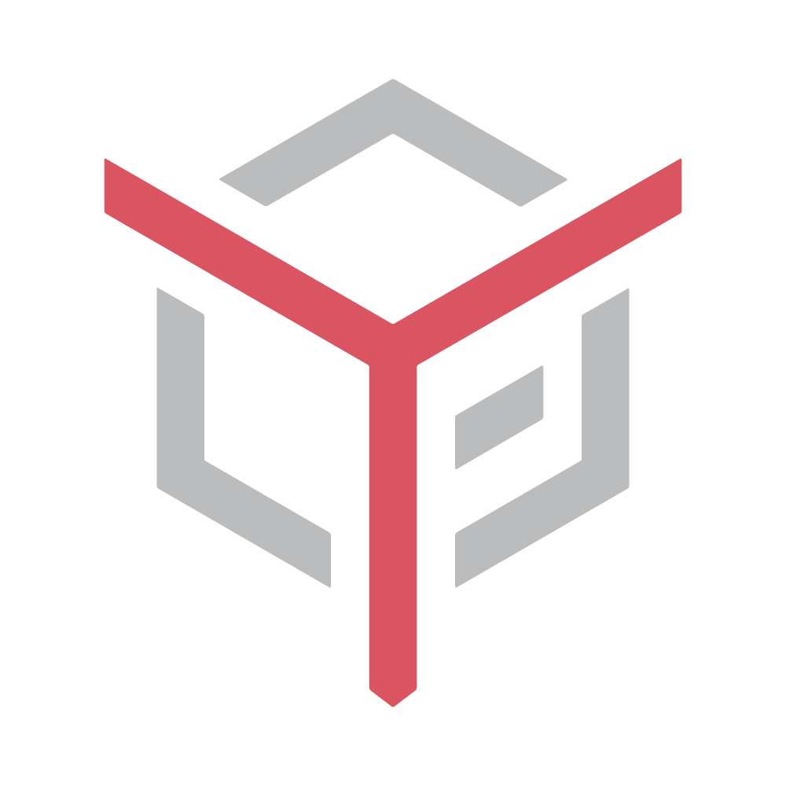

  <h1 class="display-4">Welcome to the IoP Developer Portal!</h1>
  

    Take full control of your digital life! Internet of People provides you self-sovereign identities (SSI) and offers to own multiple independent private personas. You can create and witness claims about personas and also share only relevant parts of such claims for verification, letting you securely manage every aspect of your life.
  

  

    IoP's technology is open source and available for anyone. Although IoP is dedicated to providing a complete solution to the problems of online identity and privacy, IoP is fully modular without vendor lock-in: users and businesses are free to use and combine any part of the stack they want.
  

  

    

      

        
        

          <h4 class="card-title">IoP Hydra Blockchain</h4>
          <h6 class="card-subtitle mb-2 text-muted">Project Hydra</h6>
          
dPos blockchain extended with a layer-2 consensus to provide a public ledger for IoP DAC.

          <a href="#/hydra" class="btn btn-sm btn-outline-primary mt-auto">LEARN MORE</a>
        

      

    

    

      

        
        

          <h4 class="card-title">IoP DAC</h4>
          <h6 class="card-subtitle mb-2 text-muted">Project Morpheus</h6>
          
Decentralized Access Control framework based on <a href="https://w3c.github.io/did-core">W3C standards</a> to store schemas, decentralized IDs (DIDs), keys, rights and proof timestamps on a ledger for public verification, keeping verifiable claims (VCs) off-ledger.

          <a href="#/dac" class="btn btn-sm btn-outline-primary mt-auto">LEARN MORE</a>
        

      

    

    

      

        
        

          <h4 class="card-title">IoP Fort</h4>
          <h6 class="card-subtitle mb-2 text-muted">Project Prometheus</h6>
          
Umbrella project for applications that use DAC in any way.

          <a href="#/fort" class="btn btn-sm btn-outline-primary mt-auto">LEARN MORE</a>
        

      

    

  

