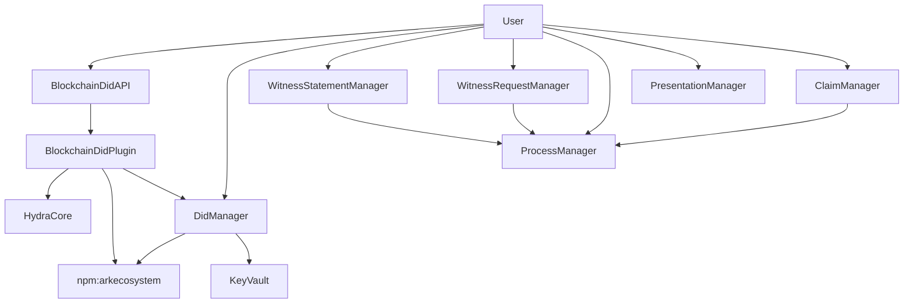
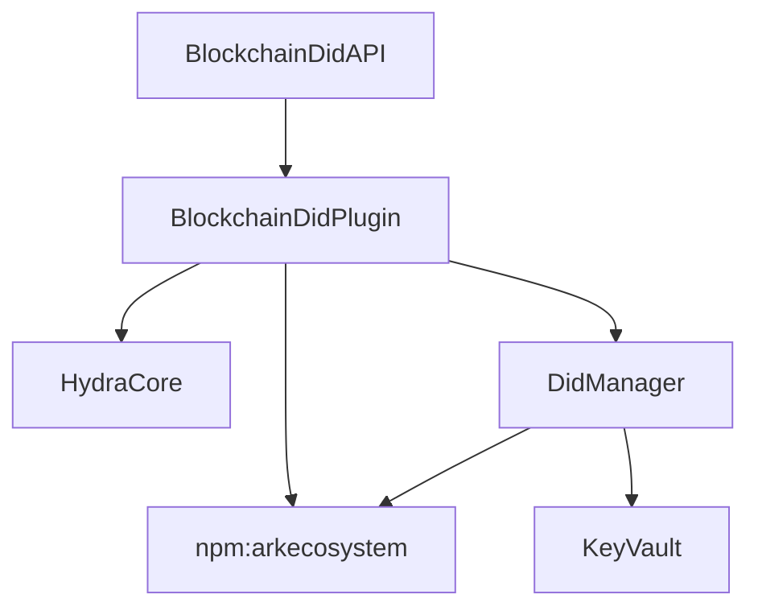
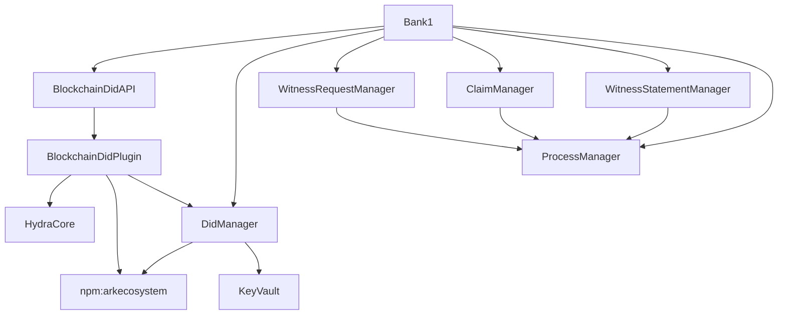
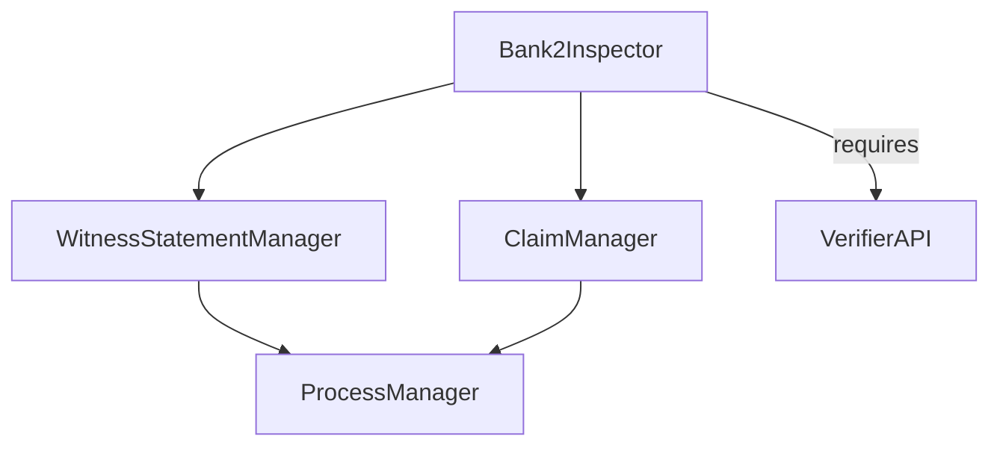
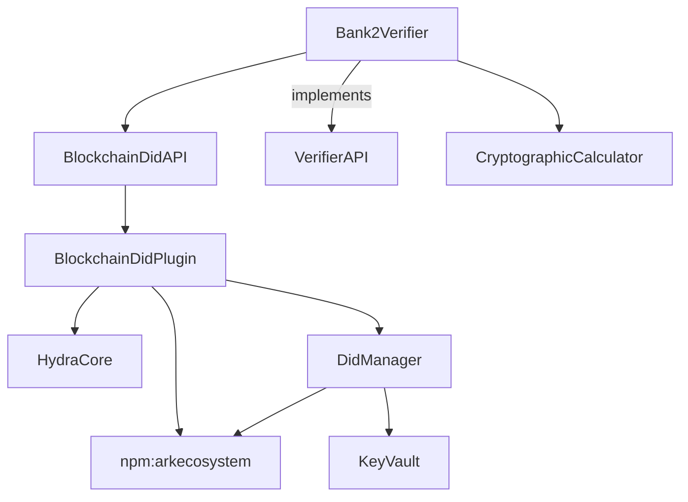

# DIDs on Chain Architecture (Morpheus)

Here we define what kind of participants are needed to be fulfill the example use case (building on the KYC example). Also we define what toolset, API, etc. is needed for the given participants, hence the architecture will fully be described. There is an incomplete [Morpheus SDK](sdk.md) documentation that needs to be integrated into here.

## Participants and its Architecture

### User Dependencies

Required toolset:

- keyvault for key-management
- DID with related DID document
- read process entries of BANK1
- share the latest DID document somewhere -> blockchain
- create claims + WitnessRequest
- sign WitnessRequest
- verify SignedWitnessStatement
- create presentations
- transfer presentations to Inspector



### Blockchain Plugin Dependencies

Required toolset:

- receive transactions for creating/modifying DID documents
- resolve DID to DID Document
- search for the DID document
  - by timestamp-range?
  - optional, caching for performance: by cryptographic public key and/or key id
- handle DID document updates



### Bank1 Dependencies

Required toolset:

- keyvault for key-management
- DID with related DID document
- share process entries with Users
- verify User's WitnessRequest
- sign WitnessStatement



### Bank2 Inspector Dependencies

Required toolset:

- securely connects to a verifier and uses its verification service (by sending signatures, content IDs and DIDs) masking out all contents
- a tool to receive and display the presentation received from its subject
- a tool to display the verification status or error(s)



### Bank2 Verifier Dependencies

Required toolset:

- securely receives the signatures, content IDs and DIDs from the delegated Inspector (no personal information)
- can connect to the blockchain to resolve DID Documents from DIDs and check blockhashes and logical timestamps
- can calculate cryptography



## Describing Architecture

### KeyVault

The Prometheus KeyVault derives public keys for DID generation under the "morpheus" subtree.
> I'm still not convinced here [name=Bartmoss]

Already done directly with `prometheusd`, likely using `prometheus-cli`. If the use case requires, KeyVault can easily be extracted out into a standalone runnable.

- generate new keypair
- listing keys
- sign with a key: (TBD: currently prometheus supports signing claims only)
  - witnessRequest
  - witnessStatement
  - claimPresentation
  - Hydra AIP-11 transaction
  - "message signing"
- verify signature for a content ID with a provided public key
- verify if a provided key ID belongs to a provided public key

### DID Manager

This part will be a NPM package, a fork of [@arkecosystem/crypto](https://www.npmjs.com/package/@arkecosystem/crypto).

- create implicit DID
- create explicit DID
- add key
- revoke key
- grant right
- revoke right
- tombstone DID

TBD: define these in more details.

### Witness Statement Manager

It will be a Typescript(?) library.

- access the details of a process (claim schema, statement schema, etc.)
- unwrap a SignedWitnessRequest into Signature, Claim, Evidence (v1); the license attached to the Evidence (v2).
- verify the Signature (relies on the Blockchain extension)
- get current BlockHeight and BlockHeader from the blockchain to create "signedAfter" field.
- display the claim
- display the evidence to compare with the claim
- display licensing information (v2)
- create a statement according to the schema defined in the proces
- sign a completed WitnessStatement to create a SignedWitnessStatement
- register any of these on the blockchain for a "signedBefore" proof
  - SignedWitnessStatementID
  - ClaimID+ConstraintID+signature
  - ClaimID+Constraint+signature
  - MaskedClaim+Constraint+signature (heavily discouraged :warning:)
  - Claim+Constraint+signature (extremely discouraged :bomb:)

TBD: Do we have a separate Object called "SignedBeforeProof" that we can attach to SignedWitnessStatements in a Presentation to make lookup easier?

### Process Manager

TBD

### Claim Manager

It will be a Typescript(?) library.

- get a list of processes (including schemas)
- create claim according to a schema according to a process
- save claim with given nonces
- load saved claim

### Presentation Manager

It will be a Typescript(?) library.

- mask out fields from a claim
- combine claims and statements
- create licensing information
- sign a completed ClaimPresentation to create a SignedClaimPresentation (utilizes the KeyVault)
- save/load signed presentations

### Witness Request Manager

- wrap evidence in self-signed presentations (optional)
- create request from claim and evidence according to process
- sign completed WitnessRequest to create SignedWitnessRequest

### Blockchain Did Plugin

This extension will be a plugin. We may split this plugin into 2 parts:

- One handling Level 1 consensus, which needs to be active on all nodes.
- The level 2 consensus (the DID Database) can be extracted into another plugin that can be activated at will.

Hence we ensure that all nodes by default are able to participate in the Hydra network and by default support this custom AIP29 (see below) transaction, but still they're not forced to handle DID Document state.

#### Level 2 Corrupted State

Level 2 state is stored and built in memory. Meaning, when the node starts up, level 2 state will be built up from scratch everytime.
Even though this ensures that level 2 state is always consistent, there are some edge-cases when something goes wrong.

If we receive a revert event which contains at least one operation that we fail to apply, we think that something really bad happened and we mark the level 2 state as corrupted. After that point, we reject all incoming operations and queries made against the level 2 API.

#### AIP29 Assets

We use [AIP29](https://github.com/ArkEcosystem/AIPs/blob/master/AIPS/aip-29.md), custom transactions for managing operations on DID documents. There is intentionally no relation between authentication/authorization of Morpheus operations using Ed25519 keys and the authentication/authorization of the Hydra transaction using secp256k1 addresses. In the following example the `senderPublicKey` and the `signerPublicKey` inside the asset.

```json
# Hydra transaction with Morpheus plugin
{
  "version": 2,
  "network": 128,
  "typeGroup": 4242,
  "type": 1,
  "nonce": "3",
  "senderPublicKey": "0333931e52c1fa65c7ce13d50f7ca0a58442b48a54844effea83851108779cd6d3",
  "fee": "9192000",
  "amount": "0",
  "asset": {
    "operationAttempts": [
      {
        "operation": "registerBeforeProof",
        "contentId": "cqzSomething"
      },
      {
        "operation": "signed",
        "signables": [
          {
            "operation": "addKey",
            "did": "did:morpheus:ezSomething",
            "auth": "IezSomethingElse"
          },
          {
            "operation": "addRight",
            "did": "did:morpheus:ezSomething",
            "auth": "IezSomethingElse",
            "right": "update"
          }
        ],
        "signerPublicKey": "PezSomething",
        "signature": "SezSomething"
      }
    ]
  },
  "signature": "e4435a288960ef7b6f3d48491ab40baa3d3d8398e83a6827f68ad19fbabf89d1db03165572bf9e4573ae33c1fbeb8b0751dd987e8b519afb70e55c0579671f89",
  "id": "6908c93e24fc6cd7befc98023b042ae6bbb4db61a4444ec4dd548c079e5f310f"
}
```

## Component/Data Diagram

```mermaid
classDiagram
  class ContentId
  Serializable <|-- ContentId

  class Unique
  Unique: <<"interface">>

  class Signature
  Signature: +publicKey: PublicKey
  Signature: +bool validate(bytes: Serializable)

  class Serializable
  Serializable: <<"interface">>
  Serializable: +byte[] getBytes()
  Serializable: +ContentId contentId()

  class Signable
  Signable: <<"interface">>
  Serializable <|-- Signable
  Unique <|-- Signable
  Signable o-- ContentId
  Signable: +Signature signWith(key: PrivateKey)

  class Claim
  Claim: +MorpheusValue data
  Claim: +DID subject

  class IWitnessRequest
  Signable <|-- IWitnessRequest
  IWitnessRequest <|-- AfterEnvelopeWitnessRequest
  IWitnessRequest: +MorpheusValue evidence
  IWitnessRequest: +u256 nonce

  class AfterEnvelopeWitnessRequest
  AfterEnvelopeWitnessRequest: +blockHash
  AfterEnvelopeWitnessRequest: +IWitnessRequest request

  class WitnessRequest
  AfterEnvelopeWitnessRequest *-- WitnessRequest
  IWitnessRequest <|-- WitnessRequest

  class SignedWitnessRequest
  SignedWitnessRequest: +request: IWitnessRequest
  SignedWitnessRequest: +signature: Signature
  SignedWitnessRequest *-- IWitnessRequest
  SignedWitnessRequest *-- Signature
  Signable <|-- SignedWitnessRequest

  class IWitnessStatement
  IWitnessStatement *-- Claim : claim
  IWitnessStatement o-- WitnessProcess : process
  IWitnessStatement: +MorpheusValue constraints
  IWitnessStatement: +u256 nonce

  class AfterEnvelopeWitnessStatement
  AfterEnvelopeWitnessStatement: +statement: WitnessStatement
  IWitnessStatement <|-- AfterEnvelopeWitnessStatement

  class WitnessStatement
  IWitnessStatement <|-- WitnessStatement
  AfterEnvelopeWitnessStatement *-- WitnessStatement

  class SignedWitnessStatement
  SignedWitnessStatement: +signature: Signature
  SignedWitnessStatement: +statement: IWitnessStatement
  SignedWitnessStatement *-- Signature
  SignedWitnessStatement *-- IWitnessStatement
  Signable <|-- SignedWitnessStatement
  Signable <|-- IWitnessStatement

  class WitnessProcess
  WitnessProcess: +String name
  WitnessProcess: +u16 version
  WitnessProcess: +String description
  WitnessProcess: +MorpheusSchema claimSchema
  WitnessProcess: +MorpheusSchema evidenceSchema
  WitnessProcess: +MorpheusSchema contraintsSchema

  IWitnessRequest *-- Claim : claim
  IWitnessRequest o-- WitnessProcess : process
  Signable <|-- WitnessProcess
```

> **Note**: Though `SignedWitnessRequest` and `SignedWitnessStatement` are both `Serializable` and `Unique`, thus (implicitly) `Signable` themselves, they contain a signature already and it rarely makes sense to add another signature on top of that.
