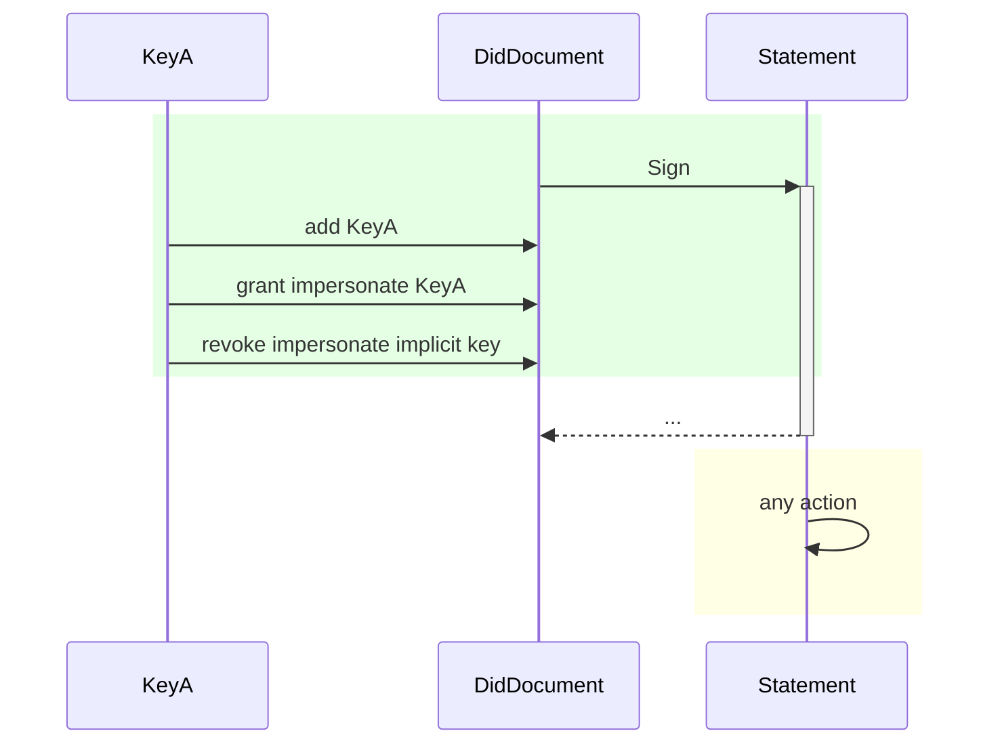

# Glossary

We assume that the reader has a basic understanding of 
- [asymmetric cryptography](https://en.wikipedia.org/wiki/Public-key_cryptography) including public and private keys
- digital signatures and [hash functions](https://en.wikipedia.org/wiki/Hash_function).

## Entity

A unique, real life actor such as a person, IoT device, company, group of people, etc. that a system wants to distinguish

## Persona

An aspect of personal life a user wants to keep separated. Real life people might have multiple identities/roles depending on their life situations, such as "dating persona" and/or "dayjob persona". A persona is also an entity.

## KeyId

A key identifier deterministically derived from a public key, e.g. a Bitcoin address. The derivation process must be irreversible, so that the public key cannot be guessed from the key identifier. To achieve this, derivations usually apply hashing functions.

## DID

All entities can generate a **d**ecentralized **id**entifier, a DID. Starting from a private/public keypair owned by an entity, a related DID is derived as KeyId of the public key.

The Prometheus KeyVault derives public keys for DID generation under the "morpheus" subtree.
> I'm still not convinced here [name=Bartmoss]
> mudlee: what is Prometheus and morpheus, why are these here?

The purpose of a DID is to reason about identity (in the mathematical sense of "being the same") over time, even when the keys used by an entity are replaced. It is decentralized so
  - each entity alone can create any number of owned DIDs.
  - there is no communication needed among entities to make sure each DID is unique.
  - owners can prove that the DID belongs to them, without verifiers (see later) getting this capability.
> mudlee: if the DID is derived as the KeyId, how can one replace the public key?

## Proof of DID Control

To proof control over a DID, an entity has to prove control over a private key with the correct authorization by signing a one-time object (e.g. a Signable Request or a Signable Statement). The validation then happens by verifying the signature and then looking up the relevant DID document and making sure the key used has the correct rights.

> This feels very rough currently. We need to define rules of rights management[name=Amon Engemann]

TODO define matching against KeyId instead of public key.
> mudlee: a diagram would be good, how this lookup works. Maybe this todo is exactly about this

## DID Document

The DID document is publicly shareable data, that does NOT contain any private information, but contains permission management via keys. The document can use the `"services"` field to refer to service endpoints that have additional information about the entity represented by the DID.

```json
# Example
{
  "@context": "https://iop.global/did/v1",
  "did": "did:morpheus:ezFoo",
  "keys": [{
    "@id": "did:morpheus:ezFoo#key-1",
    "type": "Ed25519PublicKey",
    "controller": "did:morpheus:ezFoo"
    "bytes": "pezFoo",
    "addedHeight": 504784,
    "revokedHeight": 516501,
  }, {
    "@id": "did:morpheus:ezFoo#key-2",
    "type": "Ed25519KeyId",
    "controller": "did:morpheus:ezBar",
    "bytes": "iezBaz",
    "addedHeight": 514586,
    "revokedHeight": null,
  }...],
  // BIG TBD
  "rights": {
    "impersonate": [
      "#key-1", "#key-2"
    ],
    "update_did": [
      "#key-1"
    ]
  },
  // end of TBD
  "services": [{
    "id": 0,
    "type": "mercuryAddress",
    "url": "iez..."  
  }, {
    "id": 1,
    "type": "website",
    "url": "http://www.example.org"
  } ... ]
}
```
> mudlee: whate are these iez, did:morpheus and similar stuff?

TBD: The `"services"` object could also be used to link to a revocation list, an API endpoint that returns a list of all statements signed by this entity that have been revoked.

Where

- `@context` defines the DID document format.
- `keys` is strictly ordered and append only. The key itself at a specific index might be changed though.
- `keys.controller` identifies the controller of the corresponding private key.

## Implicit (Throw Away) DID Document

Some minimalistic use cases might simply need signatures and simple authorization tokens, but don't need support for multiple devices, organizational structures with delegates and other advanced rights management features. 
To make these cases simpler and cheaper, we do not always require registering a DID on a blockchain. When there's no explicitly registered DID document found, the implicit Document below is returned.
```json
{
  "@context": "https://iop.global/did/v1",
  "did": "did:morpheus:ezSomething",
  "keys": [{
    "@id": "did:morpheus:ezSomething#key-0",
    "type": "Multicipher",
    "key": {
      "display": "iezSomething",
      "??": "KeyIDv1", <-- TBD
      "cipherSuite": "Ed25519",
      "base": "base58-btc",
      "hex": "01afaf01202af...",
    }
  }],
  // BIG TBD
  "rights": {
    "impersonate": ["#key-0"],
    "update_did": ["#key-0"],
    ... // all possible rights
  },
  // end of TBD
  "services": []
}
```

TODO define multicipher somewhere around and refer to it from here
TODO clarify and finish this explanation
> mudlee: we discussed that mainly the difference(?) is that one is on the blockchain while the other one is not

In other words, anyone - able to create signatures with a public key that the DID (as KeyId) can be derived from - has total control over this DID, thus can impersonate and add new keys, but that requires registering these changes on the ledger.

## Witness

An attestant entity that has given its digital signature to some claims(see later). Using a DID, witnesses are able to change the cryptographic keys they use for signing statements over time.
> mudlee: such as? An example here would be good, like a Bank

## Authority

A company, state government or any other certificate provider entity that is trusted by many to be a reliable witness. Also, an authority might delegate signing claims to any number of witnesses, which act on behalf of the authority in certain respects. Delegations may be granted or revoked over time.
> mudlee: such as? An example here would be good, like a Bank

## Inspector

Another company, individual or any service provider entity that wants to verify the validity of a claim, presented by the subject in the form of a statement from a witness that is deemed trustworthy by the inspector. For example, an inspector can be a conductor, an event gatekeeper, a bartender, etc.

## Verifier

A service provider entity (might be conflated with the inspector) that is verifying the validity of a signature by looking up DID documents and comparing access rights. 
*Verifier does not see any private information only cryptographical hashes, signatures and stuff.*

## Content ID

Irreversible transformation of data into a shorter number.
  - Different data will be provably hashed to different numbers in practical applications.
  - Knowing only the hash of a data you cannot guess the data itself.
  - Knowing both the hash and the data you cannot create a different data that hashes to the same number.

> mudlee: is it similar to hashing? Also, I have no clue after reading the participants how the content id is connected here. Why we use it, for what purpose, when, etc.

## Claim

A set of data that contains information about a subject entity.

```json
# Example
{
  "subject": "DID",
  "content": { "ageOver": { "nonce": "zBASE58", "value": 42 } }
}
```

Note: the `nonce` field is used for data-masking, which you can read about below.

### Claim Subject

A DID of an entity (persona, company, etc.) the claim is about.

### Maskable Claim Properties

To selectively disclose parts of a claim, the claim content id can be built as the root of a Merkle-tree. This allows the user to replace the actual data values by their hashes, while still allowing verification of integrity of the claim as a whole. 
For some low entropy data, like for example the age property, it's "easy" to brute-force the value from its hash. To make it harder, properties can be marked as "maskable". These properties' value will be wrapped into an object(see the example above) with a big enough nonce (256 bit).
    - Properties with object or array types can also be marked as maskable. This introduces increasing depth into the [merkle tree](https://en.wikipedia.org/wiki/Merkle_tree) so it must be used with care.
    - Using the same subject, same claim properties, but different nonces will result in different content hashes for the claim. This can improve privacy, but can also make it harder to present these practically different claims.

## Claim Schema

A schema for the `content` field of a claim, defining what information it needs to contain. These schemas can be defined ahead of time by witnesses (or anyone for that matter), so that the contents of claims they attest can reliably be machine-read.

```json
# Example
{
  "type": "object",
  "properties": {
    "ageOver": {
      "type": "number",
      "maskable": true,
      "required": true,
      "min": 0,
      "max": 255
    }
  }
}
```

## Witness Request

Request sent by the subject to the witness, containing all information required by the Authority's process.
```json
# Example
{
  "claim": {
    "subject": "DID",
    "content": { "ageOver": { "nonce": "zBASE58", "value": 42 } }
  },
  "claimant": {
      "did": "CLAIMANT_DID",
      "key_id": 5 // TBD
  }
  "process": "cqzLINK_TO_PROCESS",
  "evidence": { "id_card_scan": "cqzLINK_TO_SCAN" },
  "nonce": "zBIG_BASE58",
}
```

> mudlee: the claimant is a new word here, who is it?

### Evidence

Attached auxiliary information allowing verification of a claim, e.g. scanned documents, photos, etc.

For some use cases, any piece of evidence may be wrapped inside a self-signed statement and then licensed using a presentation (see later). This serves several purposes: 
  1. The witness can request a license to store the evidence in exchange for signing the statement
  2. The claimant testifies that he did not upload fraudulent data 
  3. The claimant knows if a witness stores data. 

### Process

Defines the following policies:
- the expected schema of the claim
- the expected schema of the evidence
- the expected schema of witness statement
- an implied specification of the workflow used to determine if the claim is true and should be signed based on the attached evidence. 
```json
# Example
{
  "name": "ID Card Based Age Verification",
  "version": 1,
  "description": "Describes how an age can be verified based on a presented ID card. Links to a regulation of a given jurisdiction.",
  "claimSchema": "cqzLINK_TO_CLAIM_SCHEMA",
  "evidenceSchema": "cqzLINK_TO_EVIDENCE_SCHEMA",
  "constraintsSchema": "cqzLINK_TO_CONSTRAINTS_SCHEMA",
}
```

> mudlee: what is this cqz?

## Witness Statement

The complete testimony to be signed, containing the claim, the constraints and a nonce.
  ```json
  # Example
  {
    "claim": {
      "subject": "DID",
      "content": { "yearsOld": { "nonce": "zBASE58", "value": 42 } }
    },
    "process": "cqzLINK_TO_PROCESS",
    "constraints": {
      "after": "ISO8601-datetime", 
      "before": "ISO8601-datetime", 
      "witness": {
        "did": "CLERK_DID",
        "key_id": 5, // TBD, clerks might have to change keys over time
      },
      "authority": "GOVERNMENT_OFFICE_DID",
    },
    "nonce": "zBIG_BASE58",
  }
  ```
### Statement Constraints

Restrictions that apply to the validity of the witness statement, e.g. timestamp, expiry, witness DID, on behalf of authority DID, etc.

## Signed Witness Statement

Cryptographic proof that the witness agrees to the statement.
Statements can be either the actual witness statement or just the content ID of it.
```json
# Example
{
  "signature": {
    "public_key": "pezBLAH",
    "bytes": "sezFOO",
  },
  "statement": { ... see Witness Statement|content ID ... }
}
```
> mudlee: what is pez and sez?

## Claim Presentation

A collection of claims provided for validation for a verifier.
```json
# Example
{
  "claims": [{
    "claim": {
      "subject": "DID",
      "content": {
        "residence": {
          "country": { "nonce": "zBASE58", "value": "Germany" },
          "city": { "nonce": "zBAR8", "value": "Berlin" },
          "street": { "nonce": "zFOO58", "value": "Unter den Linden"},
        }
      }
    },
    "statements": [{
      "signature": {
        "public_key": "pezBLAH",
        "bytes": "sezFOO",
      },
      "statement": { ... see Witness Statement|content ID }
    }, ...]
  }, ...],
  "licenses": [{
    "issued_to": "INSPECTOR_DID",
    "purpose": "Single entrance to Pub"
    "expiry": "ISO8601-datetime",
  }, {
    "issued_to": "ANALYTICS_COMPANY_DID",
    "purpose": "Statistics"
    "expiry": "ISO8601-datetime",
  }, ...]
}
```
> mudlee: what are those `z`, `sez` and such prefixes?
> mudlee: what is this licenses field for?

## Masked Claim Presentation

The creator of the claim presentation can choose to present only ++parts of++ a claim together with the signed witness statements to a verifier, masking out remaining parts leaving just their content hashes.

It is mathematically possible to retain sensitive data from the signed claim, still having an evidence of the original signature on the original data (see Merkle-proof).

```json
# Example
{
  "claims": [{
    "claim": {
      "subject": "DID",
      "content": {
        "residence": {
          "country": { "nonce": "zBASE58", "value": "Germany" },
          "city": "cqzCITY_HASH",
          "street": "cqzSTREET_HASH"
        }
      }
    },
    "statements": [ ... see the statements above ...]
  }, ...],
  "licenses": [ ... see licenses above ... ]
}
```
## Timestamping Statements

The timestamp is (depending on the constraints' schema) included in a witness statement is only reliable if the witness is trusted by the inspector. Additional confidence in the timestamp of a signed statement (e.g. for a contract) can be achieved by using a blockchain.
- proving that a signature happened before a time instance: sending the content hash of the signed witness statement to the blockchain in a transaction. The consensus of all blockchain nodes make it practically impossible to insert transactions into the history of the blockchain, therefore it provides a strict ordering among blocks.
- proving that a signature happened after a time instance: include a block height and its hash into either the claim by the subject or the contraints of the statement by the witness. It is practically impossible to guess what the hash of a future block will be. Also, it is practically impossible to change the hash of a given block, therefore knowing the block hash is a good evidence for something happening after the time the block was created.

If a key is signing *as a delegate* for a given DID (the key was explicitly added to the DID document), the statement it signs must include a "SIGNED_AFTER" field (giving the hash of a recent block), to prove that the delegate has not pre-signed the statement before he was granted the rights. 
If delegation was involved and there is no "signed_after" field (or its invalid), verification of the signature must return a warning that the integrity of the statement could not be verified fully.
If no delegation was involved, statements still should have a "SIGNED_AFTER" unless used in a system where retrospectively invalidating keys or statements is not a concern.

If a key is *restricted* in any way, all statements that were signed with that key and NOT timestamped to the blockchain (SIGNED_BEFORE) will expire, because there is no way to ensure the validity of the signature in that situation. We must again return a Warning that the integrity of the statement is not fully guaranteed.

### Sequence Diagrams

TODO sequence/timing diagrams portraying the different timelines that lead to green, yellow and red situations as a return value for the statement validation, for both implicit keys and added keys. Also think about good description for the different warnings we give.
> mudlee: this concept was not really clear for me when we discussed.

Color Legend:
- green: It can be proven that both the signature and the sequence of grants is valid at that logical time.
- yellow: It cannot be proven that the timing of grants matches the otherwise valid signature.
- red: It can be proven that the signature is incorrect at that logical time.

#### Statement Without Before/After Timestamps Signed Implicitly


