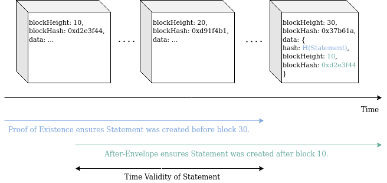

# Glossary

We assume that the reader has a basic understanding of

- [asymmetric cryptography](https://en.wikipedia.org/wiki/Public-key_cryptography) including public and private keys
- digital signatures and [hash functions](https://en.wikipedia.org/wiki/Hash_function).

## Entity

A unique, real life actor such as a person, IoT device, company, group of people, etc. that a system wants to distinguish.

## Persona

An aspect of the personal life of a user, that he/she wants to keep separated. Real people might have multiple identities/roles
depending on their circumstances, such as a "dating persona" and/or a "job persona". Morpheus makes this separation explicit by allowing the user to create multiple personas, represented by separate DIDs (see [DID below](#did)).

## KeyId

A key identifier (e.g. a Bitcoin address) deterministically derived from a public key. The derivation process must be irreversible, so that the public key cannot be guessed from the key identifier. To achieve this, derivations usually involve hash functions. Note that different use cases might mandate different hashing algorithms and display formats to identify the same public key. For this reason, you can always check whether a KeyId belongs to a public key, but 2 different KeyIds could belong to the same public key.

## Schemas

Schemas help communicating parties to settle an agreement on the data structures used. For example, before verification of claims, the presenter and verifier have to agree on the type and format of claims to be verified (see [Claim Schema](#claim-schema)).

We currently support JSON schemas.

## DID

All entities can generate a **d**ecentralized **id**entifier, a DID. Starting from a private/public keypair owned by an entity, a related DID is derived as KeyId of the public key.
By default, the originating public key is used to authenticate the controller of the DID, see [
DID document below](#implicit-throw-away-did-document).

The purpose of a DID is to reason about identity (in the mathematical sense of "being the same") over time, even when the keys used by an entity are replaced. It is decentralized so that:

- each entity alone can create any number of DIDs.
- there is no communication needed among entities to make sure each DID is unique.
- owners can prove that the DID belongs to them.
- different DIDs of the same entity by default seem unrelated to third parties.
- you can replace the authenticating keys (see below) while retaining the DID itself.
- you can split different rights (impersonation, update) on different keys.
- you can grant multiple keys the same rights.

## Proof of DID Control (Authentication and Authorization)

To prove control over a DID, an entity has to prove control over a certain keypair (private and public key) by signing a one-time object (e.g. a Witness Request or a Witness Statement).

To verify the signature, the relevant public key needs to be recovered from the signature. Validation then happens by verifying the signature (authentication) and then resolving the DID in question to its DID document and making sure the key used is authorized to act on behalf on the DID in this process (has the correct rights, authorization). If the DID Document mentions a KeyId instead of a public key, the public key used to validate the signature is hashed and compared with the KeyId.
For example, impersonation and changing the access control rules are clearly separated as different rights. Defining all possible rights is out of scope for this document.

Authorization rules for modifying access control rules receive special care. As an example, it is clear that an operation modifying the access control rules of a DID must be signed by a key that has appropriate rights for modification. However, we have a special rule to allow only modifying *other keys* and to explicitly forbid any modification for the *signer key* itself. Thus, the system protects users from accidentally revoking their own access rights or gaining additional rights without the mediation of another key.  

## Multicipher

Security awareness requires mechanisms to replace cryptographic algorithms that become weaker and even obsolete over time. Replacing hard-coded protocols usually requires enormous efforts (e.g. the obsolete SHA1 in the GIT version control system has not been replaced with a stronger algorithm for years now). As a solution, good design principles abstract away concrete cryptographic algorithms through well-designed interfaces, which allow easy replacement when needed.

There exist good libraries for concepts like hashing, base-encoding, serialization, etc. Unfortunately, we have found no appropriate one for cryptography. Following the design principles from above, we refer to such a generic cryptographic library as *multicipher*, which offers self-describing data.

In our examples below, we use the following type prefixes:

- `p`: public key
- `i`: key identifier (hash of the public key)
- `s`: signature
- `c`: content identifier (hash of maskable data structures)

The second character discriminates the actual cipher suite used:

- `e`: Ed25519 ECDSA
- `r`: Ristretto
- `s`: Secp256k1 ECDSA
- `S`: Secp256k1 Schnorr

Furthermore, our examples also use [multibase encoding prefixes](https://github.com/multiformats/multibase).

Example: `iezSomething` means a key identifier of a Ed25519 public-key base encoded with Base58-BTC.

## DAC

The Decentralized Access Control framework based on <a href="https://w3c.github.io/did-core">W3C standards</a> to store schemas, decentralized IDs (DIDs), keys, rights and proof timestamps on a ledger for public verification, keeping verifiable credentials/claims (VCs) off-ledger.

DAC's API consists of two main parts: layer-1 and layer-2. Layer-1 receives, orders and performs transactions (i.e. write operations), while maintaining a consensus of the general ledger state. Layer-2 adds more consensus rules for additional state information related to access control and serves read operations only.

## Layer-1

Custom transactions of layer-1 are stored in blocks the same way as regular Hydra transactions. This financial layer keeps track of balances of wallets and orders the transactions in the pool based on paid fees and wallet nonces. Basically, this API allows for interaction with the blockchain layer.

We use [AIP29](https://github.com/ArkEcosystem/AIPs/blob/master/AIPS/aip-29.md) custom transaction types for managing operations on DID documents. To improve privacy and flexibility, there is no relation between authentication/authorization of DAC operations using Ed25519 keys and the authentication/authorization of the Hydra transaction using secp256k1 addresses.

As layer-1 is based on custom Hydra transactions, you can initiate DAC operations simply by using the Hydra transaction's endpoint `http://YOUR_SERVER_IP:4703/api/v2/transactions`.

## Layer-2

The layer-2 consensus mechanism evaluates the custom transactions accepted on layer-1. It validates them using additional consensus rules related to access control and maintains its own state. Accordingly, Hydra transactions accepted on layer-1 may contain invalid DAC operations and can be rejected by the layer-2 consensus mechanism.
On layer-2 you can query the full history or a snapshot of its state at any given time, but changing that state can only be done through sending in transactions to layer-1.

## DAC Transaction

A DAC transaction is a Hydra [custom transaction](https://github.com/ArkEcosystem/AIPs/blob/master/AIPS/aip-29.md) sent in on [layer-1](#Layer-1).

The transaction will be forged into a valid block if it was properly formed and contains sufficient fees (layer-1 block consensus). Custom transactions enable to include multiple operation attempts. If any of the [operation attempts](#DAC-Operation-Attempt) in a single transaction is invalid with regard to the current state of the DID, all other operation attempts in the same transaction are also ignored. If all attempts are valid, an atomic change on the layer-2 state on all the DIDs is executed. ??Before-proofs and later can be retrieved as [operations](#DAC-Operation)??.

**All blockchain nodes will reach the same way conclusion whether an operation attempt is valid or not, due to the layer-2 state consensus mechanism.**

## DAC Operation

DAC operations update the state of one or more DIDs. The [Layer-1 API documentation](/api/layer1_api.md) clarifies which operations can be applied on a DID.

Some operations do not need explicit authentication, so they can be included in the transaction as a top-level item.

Some operations do need authentication, so they have to be wrapped in a signed operation. Each signed operation contains operations done that are authorized by an entity with access to a public/private keypair.

A single transaction can include multiple signed operations authenticated by different keys.

> Note, that operation attempts modify the state as if these operations have not been applied to the state. If one transaction contains multiple operations, they are executed on the state based on the transactions of the previously accepted blocks. Hence, for example you cannot add a key and revoke that key in the same transaction. It is also not possible to revoke a key, when a previous transaction creating that key has not been accepted in the blockchain.


<details>
<summary>
Example of a signed operation (Click here to expand)
</summary>

```json
{
    "operation": "signed",
    "signables": [
        {
            "operation": "addKey",
            "did": "did:morpheus:ezSomething",
            "auth": "iezSomethingElse"
        },
        {
            "operation": "addRight",
            "did": "did:morpheus:ezSomething",
            "auth": "iezSomethingElse",
            "right": "update"
        }
    ],
    "signerPublicKey": "pezSomething",
    "signature": "sezSomething"
}
```

</details>

## DAC Operation Attempt

Operation attempts are similar to unconfirmed transactions in Bitcoin. In order to update the layer-2 state, these operation attempts have to be verified by the delegates. One layer-1 transaction can contain multiple operation attempts that have to be verified and executed atomically. This ensures state consistency.

## DID Document

The DID document is publicly available data and does NOT contain any personal information. Instead, it is used to manage permissions for keypairs. The document can use the `"services"` field to refer to external service endpoints that have additional information about the entity represented by the DID. To prove the relation between the DID and these services, endpoints should refer back to the corresponding DID using e.g. DNSSEC entries.

```json
# Current layer-2 endpoint returns DID documents in this format:
{
  "did": "did:morpheus:ezbeWGSY2dqcUBqT8K7R14xr",
  "queriedAtHeight": 51063,
  "keys": [
    {
      "index": 0,
      "auth": "iezbeWGSY2dqcUBqT8K7R14xr",
      "validFromHeight": null,
      "validUntilHeight": null,
      "valid": true
    },
    {
      "index": 1,
      "auth": "iez25N5WZ1Q6TQpgpyYgiu9gTX",
      "validFromHeight": 120,
      "validUntilHeight": null,
      "valid": true
    }
  ],
  "rights": {
    "impersonate": [
      {
        "keyLink": "#0",
        "history": [
          { "height": null, "valid": true }
        ],
        "valid": true
      },
      {
        "keyLink": "#1",
        "history": [
          { "height": null, "valid": false },
          { "height": 126, "valid": true }
        ],
        "valid": true
      }
    ],
    "update": [
      {
        "keyLink": "#0",
        "history": [
          { "height": null, "valid": true }
        ],
        "valid": true
      },
      {
        "keyLink": "#1",
        "history": [
          { "height": null, "valid": false }
        ],
        "valid": false
      }
    ]
  },
  "tombstoned": false,
  "tombstonedAtHeight": null
}
```

```json
# An imaginary format that might be closer to the W3C standard:
{
  "@context": "https://iop.global/did/v1",
  "did": "did:morpheus:ezFoo",
  "lastModifiedAtHeight": 126,
  "queriedAtHeight": 51063,
  "keys": [{
    "@id": "did:morpheus:ezFoo#key-0",
    "type": "Multicipher",
    "key": {
      "display": "iezFoo",
      "kind": "KeyId",
      "cipherSuite": "Ed25519",
      "base": "base58-btc",
      "hex": "01afaf01202af...",
    },
    "validFromHeight": null,
    "validUntilHeight": null,
  }, {
    "@id": "did:morpheus:ezFoo#key-1",
    "type": "Multicipher",
    "key": {
      "display": "pezBar",
      "kind": "PublicKey",
      "cipherSuite": "Ed25519",
      "base": "base58-btc",
      "hex": "03deadbeef...",
    },
    "validFromHeight": 504784,
    "validUntilHeight": 516501,
  }],
  "rights": {
    "impersonate": [{
      "keyLink": "#key-0",
      "history": [
        { "height": null, "valid": true }
      ],
      "valid": true
    }, {
      "keyLink": "#key-1",
      "history": [
        { "height": null, "valid": false },
        { "height": 126, "valid": true }
      ],
      "valid": true
    }],
    "update": [{
      "keyLink": "#key-0",
      "history": [
        { "height": null, "valid": true }
      ],
      "valid": true
    }, {
      "keyLink": "did:morpheus:ezBar#key-5",
      "history": [
        { "height": null, "valid": false }
      ],
      "valid": false
    }]
  },
  "services": [{
    "index": 0,
    "type": "mercuryAddress",
    "url": "mercury:ezFooBar"  
  }, {
    "index": 1,
    "type": "website",
    "url": "http://www.example.org"
  } ... ]
}
```

TBD: The `"services"` object could also be used to link to a revocation list, an API endpoint that returns a list of all statements signed by this entity that have been revoked.

Where

- `@context` defines the DID document format (JSON-LD context).
- `keys` is strictly ordered and append only. Some attributes of the key at a specific index might be changed though (e.g. `revokedHeight`).
- (TODO) In the `"keyLink": "did:morpheus:ezBar#key-5"` the URI can be split by the `#` character into a controller DID and a key index. The controller is optional and can be left out to refer to keys in the same DID document. You need the controller part to explicitly grant rights to an entity represented by a different DID.

## Implicit DID Document

Some minimalistic use cases only need signatures and simple authorization tokens and don't need support for multiple devices, organizational structures with delegates or other advanced features.

To make such cases simpler and cheaper, it is not required to register a DID by adding a DID document to the blockchain. When there's no explicitly registered DID document, the implicit document below is returned as default.

```json
{
  "did": "did:morpheus:ezbeWGSY2dqcUBqT8K7R14xr",
  "queriedAtHeight": 51063,
  "keys": [
    {
      "index": 0,
      "auth": "iezbeWGSY2dqcUBqT8K7R14xr",
      "validFromHeight": null,
      "validUntilHeight": null,
      "valid": true
    }
  ],
  "rights": {
    "impersonate": [
      {
        "keyLink": "#0",
        "history": [
          { "height": null, "valid": true }
        ],
        "valid": true
      }
    ],
    "update": [
      {
        "keyLink": "#0",
        "history": [
          { "height": null, "valid": true }
        ],
        "valid": true
      }
    ]
  },
  "tombstoned": false,
  "tombstonedAtHeight": null
}
```

In other words, the default way to prove control over a newly created DID is by authenticating with the KeyId, [see above](#proof-of-did-control-authentication-and-authorization). Any updates on this implicit document have to be registered on-chain.

## Witness

An attestant entity that digitally signed some [claims](#claim). Any entity can be a witness. However, the requirements to trust a witness have to be clarified for each use case. There are lots of use cases that require commonly trusted witnesses, so called [authorities](#authority).

It is possible for witnesses to change the cryptographic keys they use for signing statements over time.

Note that the definitions of *witness* and *authority* correspond to [W3C's issuer](https://w3c.github.io/vc-data-model/#issuer), either untrusted or trusted.

## Authority

A company, state government or any other certificate provider entity that is trusted to be a reliable [witness](#witness). Also, an authority might delegate signing claims to any number of witnesses who act on behalf of the authority.
For example, a bank or university delegates appropriate rights to its clerks or employees. Delegations may be granted or revoked over time.

## Scenario

A scenario describes the set of processes and claims needed whenever an entity presents its credential. The values presented by the entity have to fulfill each claim, so that the inspector can make an informed decision about the properties tied to the DID. Each claim must conform to a specific process, therefore the scenario has to define the list of required processes in addition to the required claims.

An inspection might involve multiple scenarios, but the inspector must be able to calculate the same derived property for each scenario of the inspection.

For the [swimming pool use case](usecases/swimming_pool.md), a scenario could look like this:

```json
{
  "name": "Swimming discount",
  "version": 1,
  "description": "Reduced prices based on your resident address",
  "prerequisites": [
    {
      "process": {
        "name": "Digitalize ID card",
        "version": 1,
        "description": "Using a selfie with your ID card we make that piece of plastic obsolete.",
        "claimSchema": {
          "type": "object",
          "required": [ "address", "placeOfBirth", "dateOfBirth" ],
          "description": "We need you to provide some personal data presented on your ID card.",
          "properties": {
            "address": {
              "type": "string",
              "maskable": true,
              "description": "Eg. Berlin, Germany"
            },
            "placeOfBirth": {
              "type": "object",
              "required": [ "country", "city" ],
              "maskable": true,
              "properties": {
                "country": {
                  "type": "string",
                  "maskable": true,
                  "description": "Eg. Germany"
                },
                "city": {
                  "type": "string",
                  "maskable": true,
                  "description": "Eg. Berlin",
                  "minLength": 2,
                  "maxLength": 50
                }
              }
            },
            "dateOfBirth": {
              "type": "string",
              "subtype": "date",
              "pattern": "^(0[1-9]|1[0-9]|2[0-9]|3[0-1])\\\/(0[1-9]|1[0-2])\\\/(\\d{4})$",
              "maskable": true
            }
          }
        },
        "evidenceSchema": {
          "type": "object",
          "required": ["photo"],
          "description": "We need a selfie of you while holding your ID card that contains your address, place of birth, date of birth and your photo.",
          "properties": {
            "photo": {
              "type": "string",
              "subtype": "photo",
              "description": "A Base64 encoded photo blob"
            }
          }
        },
        "constraintsSchema": null
      },
      "claimFields": [".address"]
    }
  ],
  "requiredLicenses": [
    {
      "issuedTo": "did:morpheus:ezbeWGSY2dqcUBqT8K7R14xr",
      "purpose": "Inspection by gate-keeper",
      "expiry": "P5M"
    }
  ],
  "resultSchema": {
    "type": "object",
    "required": ["discountPercentage"],
    "properties": {
      "discountPercentage": {
        "type": "number",
        "enum": [0, 5, 10],
        "description": "Same district gets 10%, same city 5%, otherwise full price"
      }
    }
  }
}
```

## Inspector

A company, individual or service provider entity that wants to verify the validity of a claim, presented by the subject in the form of a [Signed Witness Statement](#signed-witness-statement). The trust in the validity of the statement is derived from the inspector's trust in the witness. For example, an inspector can be a conductor, an event gatekeeper, a bartender, etc. Usually inspectors provide a list of [scenarios](#Scenario) with all the details they need.

Note that we have separated [W3C's verifier](https://w3c.github.io/vc-data-model/#dfn-verifier) into a potentially different inspector (gatekeeper) and verifier (API operator).

## Verifier

A service provider entity that is verifying the validity of a signature by looking up DID documents and comparing access rights. This can be the same entity as the inspector.

*The verifier does not see any private information contained in the claim, only cryptographical hashes, signatures and other information relevant to validate the cryptography.*

## Content ID

Content IDs are used to identify and refer to a unique piece of data, such as claims. Content IDs are usually created by defining a serialization format for a dataset and applying a hash function. It has the following properties:

- Different data will be provably hashed to different values in practical applications.
- Knowing only the hash of a data you cannot guess the data itself (calculating the pre-image is hard).
- Knowing both the hash and the data you cannot create a different data that hashes to the same number (calculating a second pre-image is hard).

These properties imply that if you present a content ID to an *untrusted* peer and they show you some content that has the content ID you asked for, you can be sure that they showed you the genuine content.


## Claim

Each DID might have a set of related data (i.e. claims) about the subject it represents. [Witness Signatures](#) attest the validity of the claims. These claims can be collected inside a digital wallet and presented for verification. It is possible to keep sensitive parts of the claims private, i.e. masked out from verifiers. This ensures that the verifier only sees the data relevant for him.

```json
# Example
{
  "subject": "did:morpheus:ezFoo",
  "content": { "ageOver": { "nonce": "zB58bar", "value": 42 } }
}
```
*The `nonce` field is used for [data-masking](#maskable-claim-properties).*

Note that this definition slightly differs from its W3C's counterpart and corresponds mostly to
[W3C's verifiable credential](https://w3c.github.io/vc-data-model/#credentials).
We lack the **verifiable** from the definition simply because we only care about verifiable data
and do not bother with unverifiable ones at all.

### Claim Subject

A DID of the entity (persona, company, etc.) the claim is about.

### Claim ID

Identifiers for claims are derived as the Content ID of its serialized form. In most practical cases the `subject` and the `content` fields need to be revealed separately, but the `content` might be collapsed to its [content ID](#content-id).

### JSON Masking

JSON documents can be represented as trees, considering primitive types - such as strings and numbers - as its leaves, while composite types - i.e. objects and arrays - create its nodes.
This JSON tree can be transformed into a [Merkle tree](https://en.wikipedia.org/wiki/Merkle_tree) by recursively creating a content ID (hashing) for all the child nodes first and then calculating the hashes of the parent nodes from their children's hash. The root hash of this Merkle tree provides a JSON content ID (a.k.a. digest or fingerprint) that masks the whole document. Note that this approach enables selective integrity verification of the document. This means that some parts of the document remain masked by their hashes, while the user selectively discloses parts of the document that need to be verified. The root hash doesn't change, which means that the validity of the document can be verified without disclosing the whole content.

### Maskable Claim Properties

Using JSON as data format of verifiable claims, partial masking allows the user to replace the actual claim details by their content hashes, while still allowing verification of the integrity of the claim as a whole. For certain low entropy data, e.g. the `ageOver` property, it's relatively easy to brute-force the value from its hash. To make it harder, properties can be marked as "maskable". The value of these properties will be wrapped into an object (see the example above) with a big enough nonce (256 bit).

- Properties with object or array types can also be marked as maskable. This introduces increasing depth into the tree so it must be used with care.
- Using the same subject, same claim properties, but different nonces will result in different content hashes for the claim. This can improve privacy when requesting witness statements, but creates additional overhead when presenting these statements together as they refer to seemingly unrelated claims.

## Claim Schema

A schema for the `content` field of a claim, defining what information it needs. These schemas can be defined ahead of time by witnesses (or anyone for that matter) and registered on a blockchain, so that the contents of the claims they attest can reliably be machine-read.

```json
# Example
{
  "type": "object",
  "required": ["ageOver"],
  "properties": {
    "ageOver": {
      "type": "number",
      "description": "A number of whole years lived by the claimant. The actual age of the claimant can be much higher, but never lower.",
      "maskable": true,
      "minimum": 0,
      "maximum": 255
    }
  }
}
```

## Witness Request

Requests are sent by the **subject** or its delegate (a.k.a the **claimant**) for witnessing to an [Authority](#authority) (a.k.a the **issuer**). It should contain the information required by the verification process of that Authority.

```json
# Example
{
  "claim": {
    "subject": "did:morpheus:ezFoo",
    "content": { "ageOver": { "nonce": "zBASE58", "value": 42 } }
  },
  "claimant": "keyLink": "did:morpheus:ezCLAIMANT#5",
  "processId": "cjuPROCESS",
  "evidence": { "idCardScan": "uSCAN_BASE64" },
  "nonce": "uBIG_BASE64",
}
```

Note that hte `cju` prefix above is a [Content ID](#content-id) using JSON serialization and Base64 encoded after applying an SHA3-256 digest algorithm.

## Signed Witness Request

A [witness request](#Witness-Request) tied to its subject through a digital signature. This is sent to and verified by an [Authority](#authority), who in turn creates a [witness statement](#Witness-Statement).

```json
# Example
{
  "signature": {
    "publicKey": "pezBLAH",
    "bytes": "sezFOO",
  },
  "content": {
    "processId": "cjuPROCESS",
    "claimant": "did:morpheus:ezCLAIMANT#0",
    "claim": {
      "subject": "did:morpheus:ezFoo",
      "content": { "ageOver": { "nonce": "zBASE58", "value": 42 } }
    },
    "evidence": { "idCardScan": "uSCAN_BASE64" },
    "nonce": "uBIG_BASE64"
  }
}
```

### Evidence

Attached auxiliary information allowing verification of a claim, e.g. scanned documents, photos, etc.

For some use cases, any piece of evidence may be wrapped inside a self-signed [statement](#witness-statement) and then licensed using a [presentation](#claim-presentation). This serves several purposes:

1. The witness can request a license to store the evidence in exchange for signing the statement
2. The claimant testifies that he did not upload fraudulent data
3. If no license is requested by the witness, he is not authorized to store the data, allowing the client to legally enforce their right to data privacy.

### Process

Defines the following policies:

- the expected schema of the claim
- the expected schema of the evidence
- the expected schema of the constraints in the created witness statement
- an implied specification of the workflow and context used to determine if the claim is true and should be signed based on the attached evidence (the constraints)

This makes the process of requesting a statement fully transparent to anyone.

```json
# Example
{
  "name": "ID Card Based Age Verification",
  "version": 1,
  "description": "Describes how an age can be verified based on a presented ID card. Links to a regulation of a given jurisdiction.",
  "claimSchema": "cjuCLAIM_SCHEMA",
  "evidenceSchema": "cjuEVIDENCE_SCHEMA",
  "constraintsSchema": "cjuCONSTRAINTS_SCHEMA",
}
```

## Witness Statement

The complete testimony to be signed, containing the claim, the constraints and a nonce.

```json
# Example
{
  "claim": {
    "subject": "DID",
    "content": { "yearsOld": { "nonce": "uBIG_BASE64", "value": 21 } }
  },
  "processId": "cjuLINK_TO_PROCESS",
  "constraints": {
    "after": "ISO8601-datetime",
    "before": "ISO8601-datetime",
    "witness": "did:morpheus:ezCLERK#5",
    "authority": "did:morpheus:ezGOVERNMENT_OFFICE",
    "content": null
  },
  "nonce": "uBIG_BASE64",
}
```

### Statement Constraints

Restrictions that apply to the validity of the witness statement, e.g. timestamp, expiry date, witness DID, on behalf of authority DID, etc.

## Signed Witness Statement

Cryptographic proof that the witness agrees with the statement.
Statements can be either the actual witness statement or just the [Content ID](#content-id) of it.

```json
# Example
{
  "signature": {
    "publicKey": "pezBLAH",
    "bytes": "sezFOO",
  },
  "content": { ... see Witness Statement|content ID ... }
}
```

## Claim Presentation

A collection of claims provided for validation for a verifier.

```json
# Example
{
  "claims": [{
    "claim": {
      "subject": "DID",
      "content": {
        "residence": {
          "country": { "nonce": "uBASE64", "value": "Germany" },
          "city": { "nonce": "uBAR64", "value": "Berlin" },
          "street": { "nonce": "uFOO64", "value": "Unter den Linden"},
        }
      }
    },
    "statements": [{
      "signature": {
        "publicKey": "pezBLAH",
        "bytes": "sezFOO",
      },
      "content": { ... see Witness Statement|content ID }
    }, ...]
  }, ...],
  "licenses": [{
    "issuedTo": "did:morpheus:ezINSPECTOR",
    "purpose": "Single entrance to Pub",
    "expiry": "ISO8601-datetime",
  }, {
    "issuedTo": "did:morpheus:ezANALYTICS_COMPANY",
    "purpose": "Statistics",
    "expiry": "ISO8601-datetime",
  }, ...]
}
```

Note that contrary to its W3C's counterpart, this definition lacks word **verifiable**
simply because we only care about verifiable data and do not bother with unverifiable ones at all.


### Licensing

Claim presentations and therefore evidences (using self-signed presentations) can be shared with 3rd parties for a wide variety of purposes, including commercial use.

Based on dozens of user privacy violation scandals, terms of utilizing user data must be clarified and respected.

For example, registering on a webshop to buy a USB drive, you only want to share your e-mail to receive the receipt or warranty documents, but not for direct marketing or user tracking.

To avoid arbitrary usage of the data within the claim, presentations define licenses to restrict terms of usage. Whenever user data is utilized in any way, the data processor must present a valid license attached to personal data to prove its compliance to regulations.

## Masked Claim Presentation

The creator of the claim presentation can choose to present only parts of a claim together with the [Signed Witness Statements](#Signed-Witness-Statement) to a verifier, masking out remaining parts leaving just their content hashes.

It is mathematically possible to retain sensitive data from the signed claim, while still having an evidence of the original signature on the original data (see [Maskable Claim Properties](#maskable-claim-properties)).

```json
# Example
{
  "claims": [{
    "claim": {
      "subject": "did:morpheus:ezBar",
      "content": {
        "residence": {
          "country": { "nonce": "uBASE64", "value": "Germany" },
          "city": "cjuCITY_HASH",
          "street": "cjuSTREET_HASH"
        }
      }
    },
    "statements": [ ... see the statements above ...]
  }, ...],
  "licenses": [ ... see licenses above ... ]
}
```

## Timestamp Proofs

Signatures require verifying that contents were signed by a valid key. Since keys can be valid during a given time only, it is necessary that a signature has a notion of time tied to it. Using timestamp proofs, it is possible to check that the key was valid when the signature was generated, even if the key is not valid anymore or was not valid before a give time. An example is the digital signature of a president, which is only valid when it was generated during his term. 

Two types of timestamps can be included in a witness statement to achieve proof of validity:

- proving that a signature happened **before** a time instance: sending the hash of the signed witness statement to the blockchain in a transaction. The consensus of the blockchain nodes makes it practically impossible to insert transactions into the history of the blockchain, therefore it provides a strict ordering among blocks. This is often referred to as [Proof of Existence](#proof-of-existence).
- proving that a signature happened **after** a time instance: bundle a block height and its hash to the object in question (a claim or a witness statement) before signing (see [After-Envelope below](#after-envelope)). It is practically impossible to guess what the hash of a future block will be. Additionally, it is practically impossible to change the hash of a given block, therefore knowing the block hash is good evidence for something that happened after the time the block was created.

This is summarized in the figure below, where both the Proof of Existence (blue) and after-envelope (green) are contained in block 30. These ensure that the proof was generated during the time between block 10 and block 30. If the key was valid during this period, the signature is also valid.



> Note that tying witness statements to the blockchain and registering changes of DID Documents are completely unrelated actions and usually happen independently. They use the same blockchain to prove the order of different events.


### Revoking a Right from a Key

When a right is revoked from a key of a DID Document, there might be some signatures that are cryptographically valid, but without a proof of when that signature happened. These cannot be treated as fully authorized signatures, because there is no way to ensure that the signature was created before the key got revoked.

Therefore, if a key is *restricted* in any way, all statements that were signed with that key and NOT registered to the blockchain before the restriction (SIGNED_BEFORE) will expire.

- A verifier must give a **warning** (yellow) to an inspector when the signing key was revoked and there is no proof on the blockchain that signing happened **before** that revocation. (There might be other information off-chain that could prove the ordering of events)
- A verifier must give an **error** (red) to an inspector when either the signature is cryptographically invalid or it can be proven that signing happened **after** the revocation.

>As a special case, the implicit DID document's default key could be revoked in the future, when the elliptic-curve cryptography is replaced by a quantum-proof version.

### Granting a Right to a Key

When a key was granted new rights on a DID, in most use cases the signature has to happen **after** that grant.

Therefore, if delegation was involved and the object is not wrapped in an after-envelope (or the envelope is invalid), verification of the signature must return a warning that the integrity of the statement could not be fully verified.

- A verifier must give a **warning** (yellow) to an inspector when there is no proof in the statement that signing happened **after** the grant. (There might be other information off-chain that could prove the ordering of events.)
- A verifier must give an **error** (red) to an inspector when either the signature is cryptographically invalid or it can be proven that signing happened **before** the right was granted.

### Proof of Existence

The Proof of Existence proves that a signature has been created before a certain timestamp or block. It consists of the hash of the signature, that is included in a block. Since it is very hard to undo or change transactions once included in the blockchain, the inclusion of the hash in the blockchain testifies that the signature already existed at the time of the transaction. This can be generalized to documents, witness request or any electronic file. 

### After-envelope

To verify that a [Witness Statement](#witness-statement) has been signed after a certain block, it can be wrapped inside an after-envelope attribute before signing it to create a [Signed Witness Statement](#signed-witness-statement). The after-envelope includes the height and the hash of a recent block of the chain, proving that this information was known to the creator of the envelope. This concept can be applied to any object that is signable, like claim presentations, witness requests, etc.
