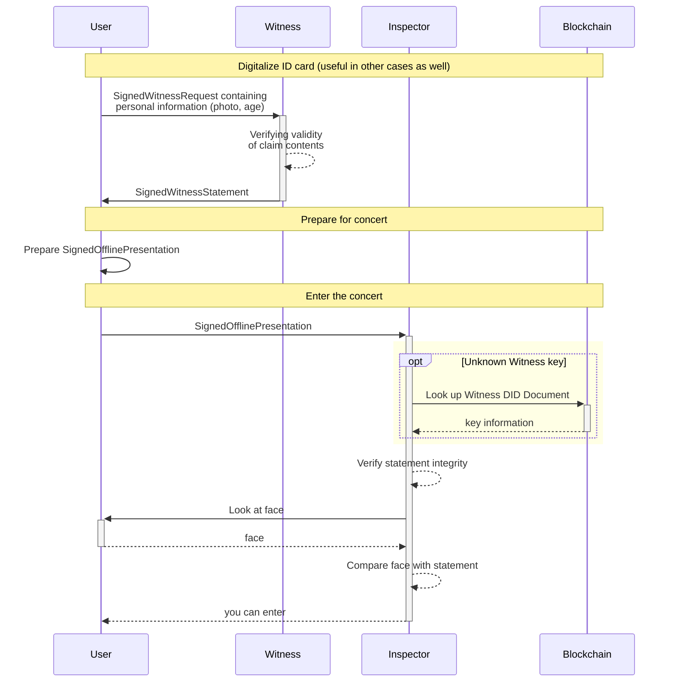
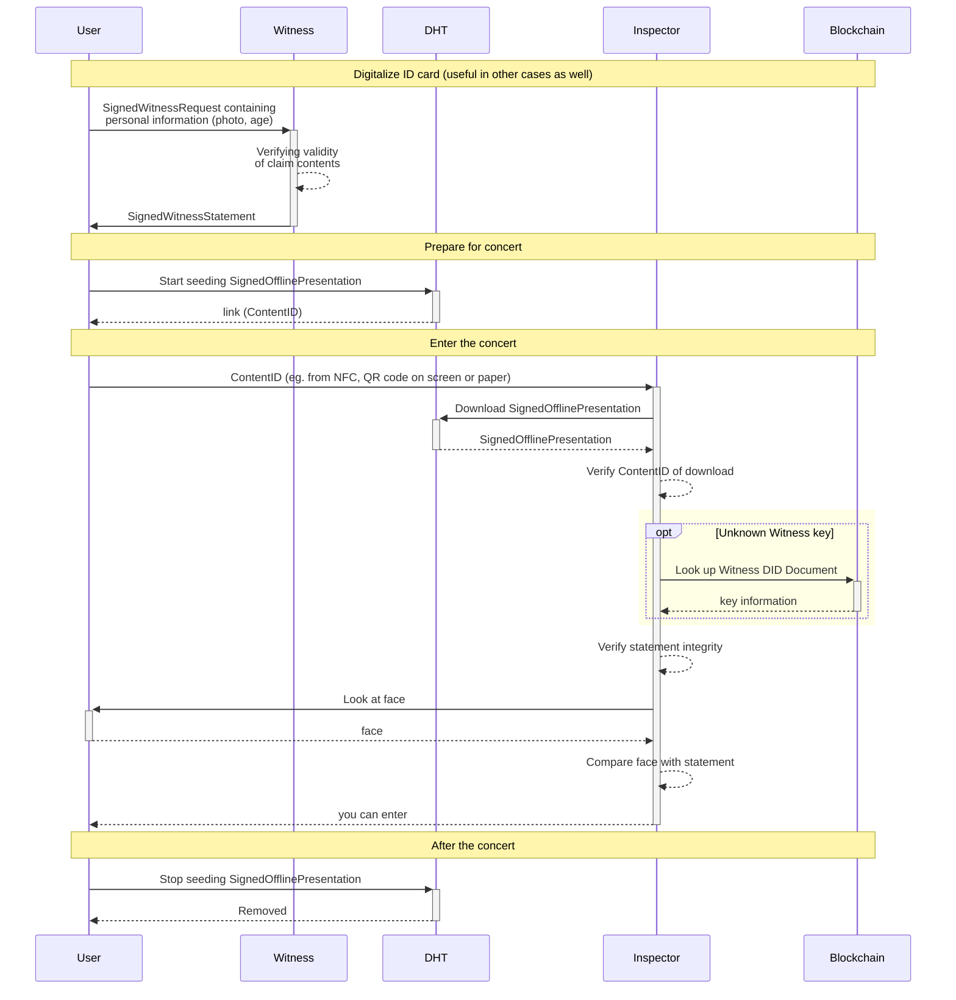

# Use Case 3: Concert Tickets with Proof of Age

> mudlee: remove all comments pls

> **Note:** we will not use custom transactions or even blockchain-based state-machines for this use case. We only use Hydra blockchain for payment, and we might store crypto stuff in the vendorField to prove that the transaction was really payed for:
> - the age proof
> - and for the ticket

In this example we have
- Witness: Authority for age
- Organizer: Authority for ticket & Verifier for age
- Inspector: Verifier for ticket

> Amon: The age authority here acts exactly like BANK1 in the KYC example.

TBD: Buying a single-use ticket for someone might be detailed

## Analog Verification of DID control

This describes the process of using a combination of claims about a DID and proving that the information in these claims applies to you to convince a third party in person (offline process) that you are in control of a DID without signing anything using your private key.

The sequence diagram above already describes the relevant parts of user experience and the workflow in general. However, it does not consider how exactly large binary data like a photo is transferred in practice from the user to the Inspector. Definitely not included in a QR code or sent directly between devices. Instead, a link (up to 512 bytes) pointing to an entry of some storage could be transferred (e.g. via NFC or QR code) that the Inspector can resolve to fetch the photo to his own device.

TODO consider and fill in the diagram below for the practical case

- To prove identity of the person purchasing the ticket (Person A) and the person presenting the purchased ticket (Person B), we need a proof of control for the DID, either via a challenge-response type of authentication, or a "human factor" (or both, 2FA). It might be useful to split the roles of A and B(A purchasing a ticket *for* B).

- The Inspector has to have an active internet connection for verifying signatures. 

- If we want to rely challenge-response authentication, person B needs to have his private key with him to do the signing. If that is unfeasible (concert tickets), we need the human factor.

- The human factor could for example be a photo of person B inside a `IdPhoto` claim, signed by the `Witness` (essentially a digital replacement of the ID-Card). The photo itself then needs to be transferred to the Inspector at check-in (or publicly hosted and an access key given to the Inspector). The Inspector can then verify that the photo used for the `IdPhoto` claim is actually depicting the person in front of him.

## Terminology

- Age Proof: see the definition of proof
- Payment Proof: ARK and therefore Hydra can easily attach a content ID to a payment transaction. This can be used to attach an off-chain service request and an on-chain payment for it. (In practise, even Paypal payments would be possible)
  - Proof of witness service purchase: Thes signed witness request's ID is written to the vendor field on the Hydra transfer transaction.
  - Proof of ticket purchase: The ticket request's hash goes to the vendor field.

> Amon: I would use an unrelated request ID here. The request is a different object from the claim. This also improves privacy in relation to uninvolved outsiders.
 
- Short QR: one way to validate the ticket purchase is to have a QR code that contains a URL, where the Inspector can validate the ticket purchase itself using the Organizer's API.
- Full QR: an another way is to have a QR code, that can be validated cryptographically by the Inspector, because it contains all relevant information.