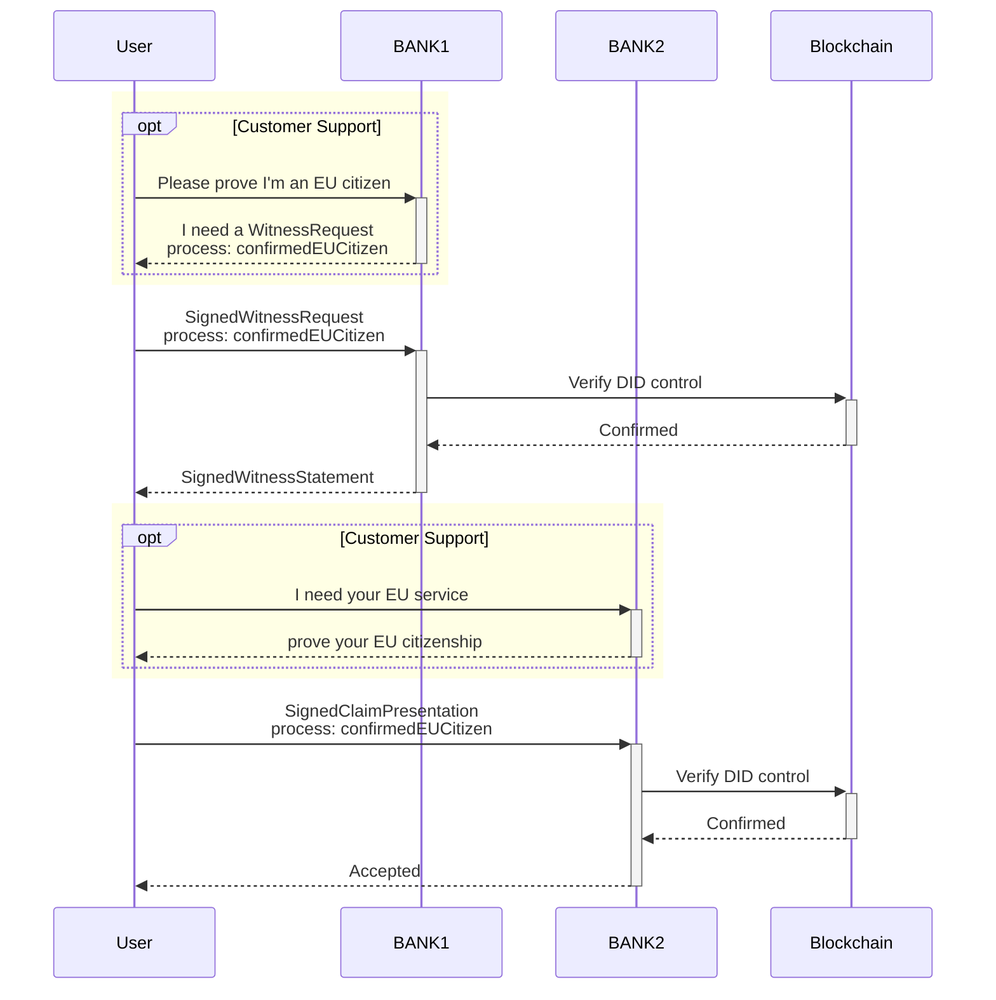
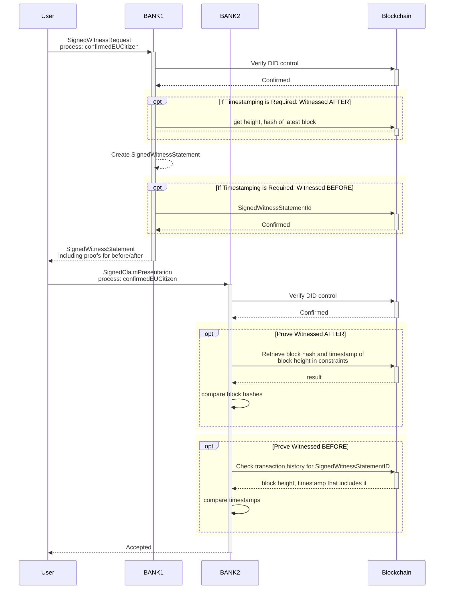

# Use Case 1: KYC

## Goal

KYC is a concept where a service provider confirms the identity and uniqueness of a user by tying their digital account to official real-world identity information. What an official identifier is depends on the actual use case and is decided by the authority that is attesting. Several companies have already outsourced this process to special "identity verification services" (IVS).

By connecting the proof of identity to a service independent ID instead of a user-account, the service of the IVS becomes a lot more useful for both the user and other service providers (saving time and money by reusing the verification).

> Modified, but correct in general.

The proof is visible on a blockchain, hence everyone can audit it.

> Amon: Why would it? Give the signed claim back to the user. (Maybe timestamp it)

## Example

> Amon: Updating this quite heavily.

In this example we have
- BANK1: Witness
- BANK2: Verifier

You want to prove the fact that you are an EU resident. For this, you show your ID card to BANK1, including your picture, your **name** and **address**, **place of birth**, etc. BANK1 will sign a claim of the type `confirmedEUCitizen` about one of your DIDs (after you prove control, of course). The claim schema may be standardized by the BANK, or even by law, possibly containing information about **how** they verified your citizenship. In addition, they might possibly timestamp the claim to a blockchain.

> Amon: Please talk about the added confidence provided by timestamping in a separate section, so *this* example stays "clean". In that section repeat the process diagrams with the added blockchain queries, so a reader can compare the two diagrams.

Then you'd like to prove your EU citizenship at BANK2 without showing your ID card again (which would expose all your private information to another third party, burdening it with GDPR compliance). To do this, you'll only provide a claim presentation containing the claim signed by BANK1 and a proof-of-control for the ID and maybe information about **how** BANK2 is allowed to use the information (your citizenship).

BANK2 then queries the blockchain about your DID and the DID of BANK1 (which is known to BANK2, probably even public information because BANK1 has announced their DID publicly). Once resolving the document they can use the public keys stated in the document to verify the validity of the signatures, proving both your ownership of the DID and the fact that BANK1 supports your claim. 

> Amon: (Alternatively, the public keys can be mentioned in the presentation/claim itself, and the DID document is just used to verify that these keys are in fact currently valid and not compromised. I might like this second version even better.)

## Timestamping Statements

This diagram extends the previous scenario and diagram with timestamping, to improve transparency of the witnessing process, e.g. in the following cases
 - BANK2 wants to audit that BANK1 is not signing statements with fake timestamps
 - BANK1 wants to make explicit the fact that they acted according to information available at a certain point in time.
 - BANK1 wants to audit its delegated witnesses

Addendum: BANK2 might now serve as a verifier to another inspector (BANK 3), who lacks the resources to verify the signatures themselves, instead outsourcing that task to BANK2, relying on a direct and secure connection to BANK2 (for the direct connection we could use Mercury).

Addendum2: It was mentioned above that the DID of BANK1 was known to BANK2. When talking about "p2p-claims" between friends, knowledge of each others DIDs functions by meeting up in person and scanning each other's QR Code. Banks could do the same on a grander scale if they don't want to publicly share some of their DIDs.

## Revocation of Claims

TODO: Add diagram specifying how BANK2 checks whether a SignedWitnessStatement is revoked on the blockchain.