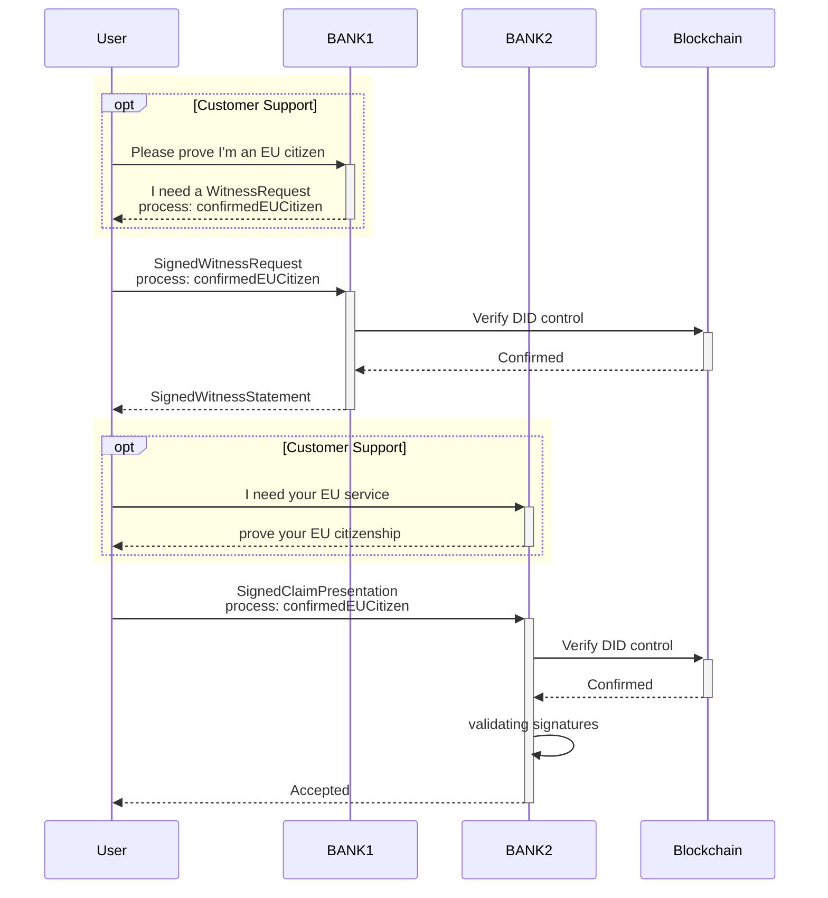

# Use Case 1: KYC

## Goal

KYC is a concept where a service provider confirms the identity (and possibly uniqueness) of a user by tying their digital account to official real-world identity information. What an official identifier is depends on the actual use case and is decided by the authority that is attesting, but it will most likely be some form of government issued ID card or a utility bill. Several companies have already outsourced the process of identity verification to special "identity verification services" (IVS).

By connecting the proof of identity to a service-independent ID instead of a specific user-account, the service of the IVS becomes a lot more useful for both the user and other service providers (saving time and money by reusing the verification), thereby generating value for everyone involved.

To keep a witness statement valid even after the key of a witness expired, the content id of the signed witness statement can be published as payload in a blockchain transaction, proving it was signed when the witness' key was still valid. 

To proof the validity of a witness statement involving delegated rights, an AfterEnvelope can be used to strictly order the statement and the key management process.

**No personal data is included in this Proof of Ordering.**

## Scenario

In this example we have
- BANK1: Witness
- BANK2: Verifier

1. You want to prove the fact that you are an EU resident. For this, you show your ID card to BANK1, including your picture, your **name** and **address**, **place of birth**, etc. BANK1 will create a statement, attesting your claim of the type `confirmedEUCitizen` about one of your DIDs (after you prove control, of course). The claim schema may be standardized by the BANK, or even by law, possibly containing information about **how** they verified your citizenship. In addition, they might register the statement ID to the blockchain.

2. Then you'd like to prove your EU citizenship at BANK2 without showing your ID card again (which would expose all your private information to another third party, burdening it with GDPR compliance). To do this, you'll only provide a claim presentation containing the statement signed by BANK1 and a proof-of-control for your DID. Additionally you can include information about **how** BANK2 is allowed to use the information ("licensing").

3. BANK2 can validate all signatures involved in the claim presentation (BANK1's signature for the statement, the USER's signature for the presentation). BANK2 then queries the blockchain about your DID and the DID of BANK1 (which is known to BANK2, probably even public information because BANK1 has announced their DID publicly). Once they resolved the documents, they can verify that the keys had the correct rights at the time of signing, proving both your control of the DID and the fact that BANK1 supports your claim.

## Timestamping Statements

This diagram extends the previous scenario and diagram with timestamping, to improve transparency of the witnessing process, e.g. in the following cases:
 - BANK2 wants to audit that BANK1 is not signing statements with fake timestamps.
 - BANK1 wants to make explicit the fact that they acted according to information available at a certain point in time.
 - BANK1 wants to audit its delegated witnesses.
 - BANK1 is regularly rotating keys, therefore it is necessary to order the statements in relation to the process of key rotation.

Addendum: BANK2 might now serve as a verifier to another inspector (BANK 3), who lacks the resources to verify the signatures themselves. BANK3 might outsource that task to BANK2, relying on a direct and secure connection to BANK2.
(TBD: for the direct connection we could use Mercury).

Addendum2: It was mentioned above that the DID of BANK1 was known to BANK2. When talking about "p2p-claims" between friends, knowledge of each other's DIDs is achieved by meeting up in person and scanning each other's QR Code. Banks could do the same on a grander scale if they don't want to publicly share some of their DIDs.
