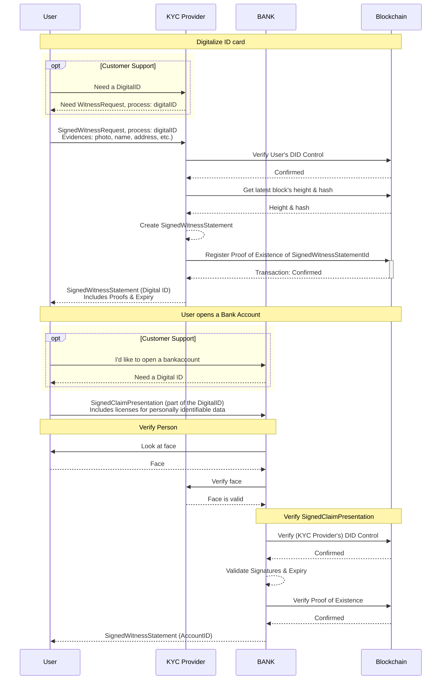
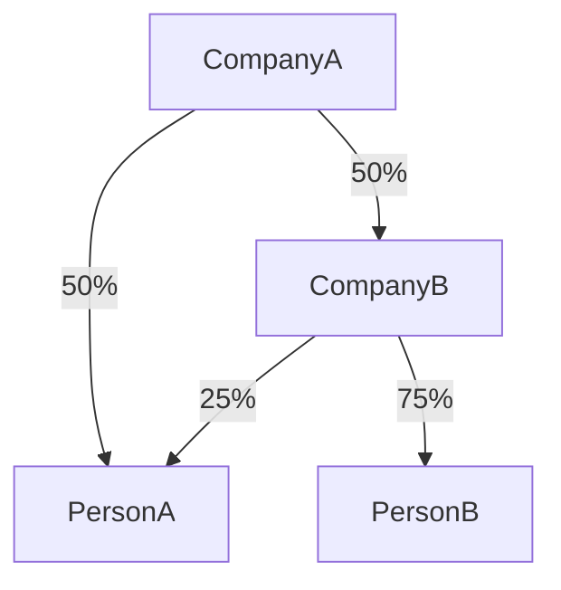
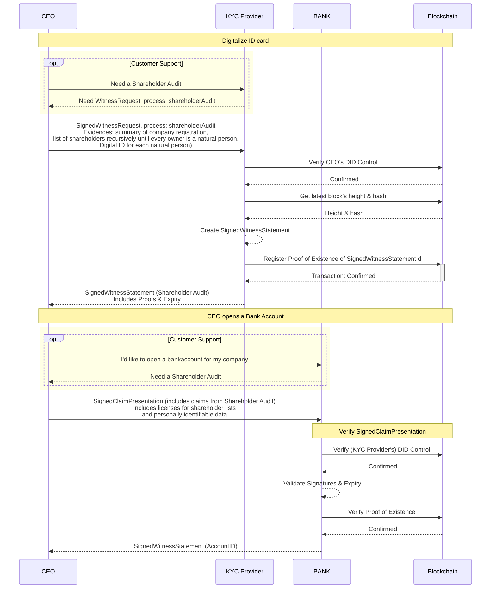

# Identification with DigitalID via KYC Providers

## Goal

KYC is a concept where a service provider confirms the identity (and possibly uniqueness) of a user by tying their digital account to official real-world identity information. What an official identifier is depends on the actual use case and is decided by the authority that is attesting, but it will most likely be some form of government issued ID card or a utility bill. Several companies have already outsourced the process of identity verification to special "identity verification services" (IVS).

By connecting the proof of identity to a service-independent ID instead of a specific user-account, the service of the IVS becomes a lot more useful for both the user and other service providers (saving time and money by reusing the verification), thereby generating value for everyone involved.

By using user-generated asymmetric keypairs as a digital account (SSI) and handing out cryptographic proofs of the user going through the attestation process (credentials), the IVS can even go as far as deleting all evidence and personally identifiable data from their systems after witnessing them. The user owns all credentials, signatures to cryptographically prove their identity afterwards. The IVS only needs to store a few pieces of anonymized stable data (like a salted digest of a state assigned identifier) if some of the use-cases require that one real-world person has a single user account tied with some attributes.

## Scenario 1: Natural Person Opens Bank Account

In this example we have

- Citizen: User
- KYC Provider (IVS): Witness
- BANK: Verifier

You want to provide all information legally required while opening a bank account. The bank outsourced the checking of your documents to an IVS to streamline their personnel. For this, you show your ID card to KYC Provider, including the photo of your **face**, your **name** and **address**, **place of birth**, etc. KYC Provider will create a statement, attesting your claim with all these data based on the evidence you provide them (scan of your documents, photo of you holding these documents, etc.) The claim schema may be standardized by the BANK, the IVS or even by law, possibly specifying **how** they have to verify your data. In addition, they might register the statement ID on the blockchain so you can prove ordering of some events.

Then you'd like to register at BANK presenting only the digitalized claims witnessed by the IVS. The signatures of the KYC Provider on your claims and a proof-of-control for your DID proves the bank that you went through all the checks the IVS describes in its processes. The bank might optionally check your face against the photo witnessed by IVS. Additionally you can include information about **how** BANK is allowed to use the information ("licensing"), so the BANK can show these licenses for all personally identifiable data they have to handle by law.

BANK can validate all signatures involved in the claim presentation (KYC Provider's signature for the statement, the USER's signature for the presentation). BANK then queries the blockchain about your DID and the DID of KYC Provider (which is known to BANK, probably even public information because KYC Provider has announced their DID publicly). Once they resolved the documents, they can verify that the keys had the correct rights at the time of signing, proving both your control of the DID and the fact that KYC Provider supports your claim. See [Proof of Ordering](#proof-of-ordering)

## Costs 1

- 1 SSI Write:
  - Timestamp for the signed witness statement
- 2 Credential exchanges:
  - IVS checking signature validity on the witness request of the user
  - Bank checking signature validity on the statement from the IVS

## Sequence Diagram 1

## Scenario 2: Legal Person Opens Bank Account

In this example we have

- CEO, shareholders: User
- KYC Provider (IVS): Witness
- BANK: Verifier

A German company wants to open a bank account at a German bank. Legally they are required to share the summary of company registration and the whole list of shareholders. If a shareholder is a legal person, they need the same data recursively for that company. If a shareholder is a natural person, they need some identifiers from them in the whole graph of owners.

## Costs 2

- For each node on the shareholder graph (you can reuse the same node if a natural or legal person is in there multiple times)
- 1 SSI Write:
  - Timestamp for the signed witness statement
- 2 Credential exchanges:
  - IVS checking signature validity on the witness request of the user
  - Bank checking signature validity on the statement from the IVS

So for an example where the company who is applying is owned both by a natural person and a company which is owned by the same natural person, plus another natural person:

You have 4 nodes on this diagram, so you need 4 SSI Writes and 4x2 credential exchanges.

## Sequence Diagram 2

## Proof of Ordering

To keep a witness statement valid even after the key of a witness expired, the content id of the signed witness statement can be published as payload in a blockchain transaction, proving it was signed when the witness' key was still valid.

To prove the validity of a witness statement involving delegated rights, an AfterEnvelope can be used to strictly order the statement and the key management process.

**No personal data is included in this Proof of Ordering.**
