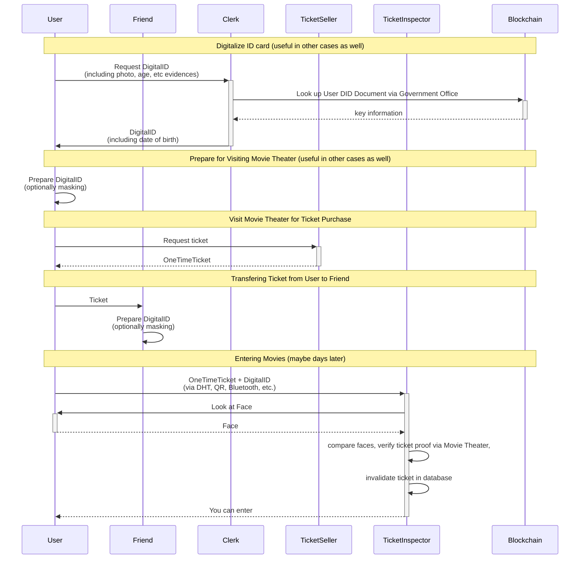

# Non-Personalized Tickets Usecase

## Scenario

A user wants to purchase a ticket to see a movie for mature audiences. He later wants to hand over the ticket to a friend of his.

## Goals

- Both users want to to proof their age using a digital form of identification, but without needing to carry their private keys everywhere they go.
- The movie theater needs to control both age and validity of the ticket. 
- Handing over the purchased ticket should be as simple as possible. 
- "forging" a ticket needs to be practically impossible.

## Solution


### Proof of Ticket Purchase

For example the movie could create a JSON object with the following content and store it to its internal database (RocksDB, MongoDB, etc.):

```json
{
  "event": {
    "title": "Deadpool 5",
    "date": "2020-05-24 5PM",
    "screen": 4,
  },
  "seating": {
    "row": 4,
    "chair": 14,
  },
  "nonce": "0xBEEFBEEF"
}
```

Note that the nonce is a randomly generated one-time number and thus can serve as a secret to proof the ticket was obtained regularly (stealing and coercion are out of scope for this use case. The purpose of this nonce is to prevent ticket forging, e.g. by "guessing" the ticket data for a well-known movie).

To prove the ticket purchase later on site, the user only has to present the ticket information + nonce.


### Digitalized ID Card

In our daily lives, we regularly use our ID cards to prove claims about ourselves to a third party. This process functions by tying the relevant information (e.g date of birth) to some non-forgeable information (the face of the user) together into a single, forging-resistant object.
This concept can be transferred into the digital world easily. For this, we need 

- a photo of the applicant
- a piece of relevant information (e.g. age)
- at least one trusted witness

If we can present statements by a trusted authority that 

1. a certain photo depicts the owner of a certain DID
2. some information is true for the same DID

they give the same confidence in any statement as an ID card issued by that authority, without necessitating the proof of key ownership, instead relying on manual comparison of the face with the photo. A statement like this is indeed even more forging resistant than a physical ID card, provided the underlying cryptography scheme is reliable. Furthermore, for flexibility, the two statements can come from different authorities, the two pieces of information can be combined into a single statement, etc. 

To simplify the concepts presented in this section, we will refer to the combination of information about a certain DID with a photo as a "digital ID card" from now on. 

#### Proving Information vs. Privacy

Claim presentations are prepared for masking unrelated details from the inspector. For proving age, we should not only mask out name and photo, but we don't even need the date of birth, only an `age-over` flag. However, proving claims derived from existing claims is not trivial. We can imagine a service (possibly the government during ID digitization) which inspects date of birth and issues a secondary witness statement that we're above 21, to enhance privacy.

#### Photo transmission

Transferring a full image is not feasible in most cases. For this purpose, the photo itself can be masked out of the claim like any other data. 
To be able to match the ticket exactly to the user's face, users can share a URL (possibly incl. an access key) with the inspector resolving to the picture on web storage (DHT, Google Drive, etc.) that hashes to the content ID in the digitalized ID card. known by the user and user's face actually matches that photo. 

Note: If "photo-hash-mining" becomes an issue in the future, the photo could be hosted by the authority creating the statement. 

### QR Code usage

Large binary data like a photo is not feasable to be transferred in practice from the user to the Inspector. Instead, a link (up to 512 bytes) pointing to an entry of some storage could be transferred, which the Inspector can resolve to fetch the photo to his own device.

One way to share all the information mentioned above is to have a QR code that contains a URL and access key. The inspector can then resolve all the necessary information for local verification.

The QR Code can of course also be used by the Inspector to validate the ticket purchase using the Organizer's API.

****


### Public Proofs

ARK and therefore Hydra can easily attach a content ID to a payment transaction. This can be used to attach an off-chain service request to an on-chain payment for it.

  - Proof of witness service purchase: These signed witness request's ID is written to the vendor field on the Hydra transfer transaction.
  - Proof of ticket purchase: The ticket request's content ID is written to the vendor field on the Hydra transfer transaction.

## Simplified Overview

1. The User goes to the government office to get a digitalized ID card, meaning the user gets a digital proof about their name, address, photo, etc. 
This step is needed only once and can be used for any number of tickets or other use cases afterwards.
1. User goes to the movie theater (days before the movie is shown) to buy a ticket for a movie for mature audiences. In exchange, the user receives a digital proof of ticket purchase.
1. On the day of the movie User gets sick and he asks his friends on social media if anyone can use his ticket as he cannot go.
1. Friend says "Sure I'd like to see that movie. Also, I'm free today evening. Please give me the ticket". 
**Note:** We assume the Friend has already completed step 1 as well, meaning they have a digitalized ID card.
1. Friend goes to the movie theater with
   - a proof of ticket purchase
   - his digital ID
2. The inspector at the gate validates both and decides if the user can enter or not. During this process the inspector also invalidates the ticket in the movie's database for further entries (or reduces the number of allowed entries on a multi-ticket, etc.).


### Participants

- User
- Friend
- Clerk (delegate of the Government Office)
  - Witness for digital ID
- Government Office
  - digital ID Authority
- Ticket Seller (delegate of the Movie Theater)
  - digital ID (especially the age) Inspector
  - delegated ticket purchase Witness
- Ticket Inspector (delegate of the Movie Theater)
  - ticket purchase Inspector
  - face Verifier (offline, see later)
- Movie Theater
  - digital ID Verifier (when buying the ticket)
  - ticket Authority
  - ticket purchase Verifier


## Sequence Diagram

This describes the process of using a combination of claims about a DID and proving that the information in these claims applies to you to convince a third party in person (offline process) that you are in control of a DID without signing anything using your private key.




