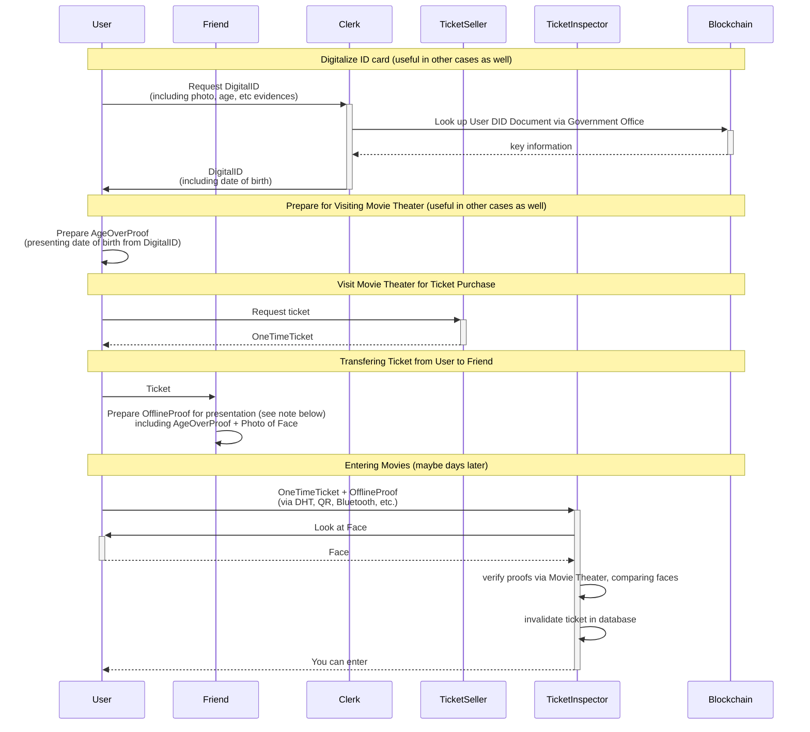

# Use Case 3: Non-Personalized Tickets

## Scenario

1. User goes to the government office to get a digitalized ID card, meaning the user gets a digital proof about their name, address, photo, etc. 
This step is needed only once and can be used for any number of tickets or other use cases afterwards.
1. User goes to the movie theater (days before the movie is shown) to buy a ticket for a movie for mature audiences. In exchange, the user receives a digital proof of ticket purchase.
1. On the day of the movie User gets sick and he asks his friends on social media if anyone can use his ticket as he cannot go.
1. Friend says "sure I'd like to see that movie. Also, I'm free today evening. Please give me the ticket". 
**Note:** we suppose that Friend already did step 1 too, so they have an age-over proof.
1. Friend goes to the movie theater with
   - a proof of ticket purchase
   - a proof of DID control and age-over claim
1. The inspector at the gate validates both and decides if the user can enter or not. During this process the inspector also invalidates the ticket in the movie's database for further entries (or reduces the number of allowed entries on a season ticket).

### Participants

- User
- Friend
- Clerk (delegate of the Government Office)
  - Witness for digital ID
- Government Office
  - digital ID Authority
- Ticket Seller (delegate of the Movie Theater)
  - digital ID (especially the age) Inspector
  - delegated ticket purchase Witness
- Ticket Inspector (delegate of the Movie Theater)
  - ticket purchase Inspector
  - face Verifier (offline, see later)
- Movie Theater
  - digital ID Verifier (when buying the ticket)
  - ticket Authority
  - ticket purchase Verifier

> **Note:** Besides managing DID Documents (i.e. delegate rights and revocations) on the blockchain, we also use the Hydra blockchain for payments, both covering fees of witness requests/signed witness statements and potentially for ticket costs.

### Proving Age-Over vs. Privacy

Claim presentations are prepared for masking unrelated details from the inspector. For proving age, we should not only mask out name and photo, but we don't even need the date of birth, only an `age-over` flag. However, proving claims derived from existing claims is not trivial. We should use a service (possibly the government during ID digitization) which inspects date of birth and issues a witness statement that we're above 21.

### Proving Photo

To be able to match the ticket exactly to the user's face, users have to share a proof with the inspector that the photo masked out from his digitalized ID claim (i.e. a photo hash) resolves to a specific picture known by the user and user's face actually matches that photo.

## Sequence Diagram

This describes the process of using a combination of claims about a DID and proving that the information in these claims applies to you to convince a third party in person (offline process) that you are in control of a DID without signing anything using your private key.




### Ticket Proof

To prove the ticket purchase later on site w, the Friend has to prepare and upload the proof to a storage where the TicketInspector can access and check its contents.

The ticket in this case is similar to a server-side session. 
For example the movie could create a JSON object with the following content and store it to its internal database (RocksDB, MongoDB, etc.):

```json
{
  "show": {
    "event": "Deadpool 5",
    "date": "2020-05-24 5PM",
    "room": 4,
  },
  "seating": {
    "row": 4,
    "chair": 14,
  },
}
```

The content ID of this ticket could be handed out then to the user.

The sequence diagram above already describes the relevant parts of user experience and the workflow in general. However, it does not consider how exactly large binary data like a photo is transferred in practice from the user to the Inspector. Definitely not included in a QR code or sent directly between devices. Instead, a link (up to 512 bytes) pointing to an entry of some storage could be transferred (e.g. via NFC or QR code) that the Inspector can resolve to fetch the photo to his own device.

- Payment Proof: ARK and therefore Hydra can easily attach a content ID to a payment transaction. This can be used to attach an off-chain service request and an on-chain payment for it. (In practice, even Paypal payments would be possible)
  - Proof of witness service purchase: These signed witness request's ID is written to the vendor field on the Hydra transfer transaction.
  - Proof of ticket purchase: The ticket request's hash goes to the vendor field.
- QR code usage: one way to validate the ticket purchase is to have a QR code that contains a URL and access key. Using these, the Inspector can validate the ticket purchase alone using the Organizer's API.