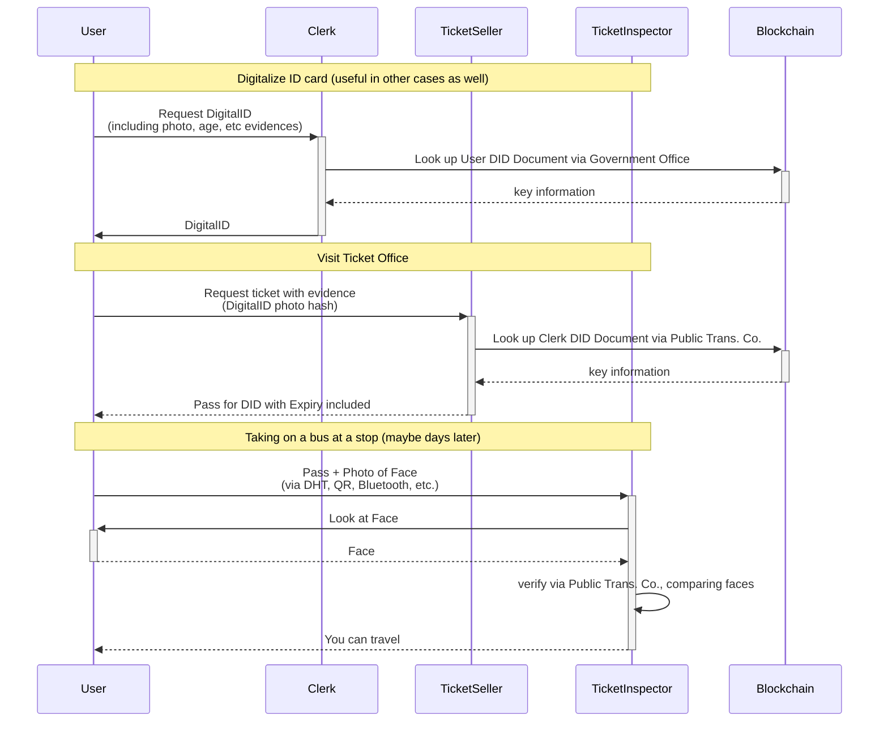

# Use Case 4: Personalized Tickets

For example, buying and using a public transportation pass that is untransferable. 
I.e. **cannot be used by anyone else**, only by the buyer's DID.

## Scenario

1. User goes to the government office to get a digitalized ID card, meaning the user gets a digital proof about their name, address, photo, etc. 
This step is needed only once and can be used for any number of tickets or other use cases afterwards.
1. User goes to the ticket office (typically days before using the ticket) to buy a monthly ticket for public transportation. In exchange, the user receives a digital proof of ticket ownership. 
1. User goes to the subway for traveling (e.g. from home to university) holding
   - a proof of ticket ownership
   - a proof of DID control
1. The inspector at the gate validates both and decides if the user can enter or not.

### Participants

- Clerk (delegate of the Government Office)
  - Witness for digital ID
- Government Office
  - digital ID Authority
- Ticket Seller (delegate of the Public Transportation Company)
  - digital ID Inspector
  - delegated ticket purchase Witness
- Ticket Inspector (delegate of the Public Transportation Company)
  - ticket purchase Inspector
  - face Verifier (offline, see later)
- Public Transportation Company
  - digital ID Verifier (when buying the ticket)
  - ticket Authority
  - ticket purchase Verifier

> **Note:** Besides managing DID Documents (i.e. delegate rights and revocations) on the blockchain, we also use the Hydra blockchain for payments, both covering fees of witness requests/signed witness statements and potentially for ticket costs.

### Proving Photo

To be able to match the ticket exactly to the user's face, users have to share a proof with the inspector that the photo masked out from his digitalized ID claim (i.e. a photo hash) resolves to a specific picture known by the user and user's face actually matches that photo.

## Sequence Diagram

This describes the process of using a combination of claims about a DID and proving that the information in these claims applies to you to convince a third party in person (offline process) that you are in control of a DID without signing anything using your private key.

> **Note:** public transportation often uses entrance gates with automated ticket/pass validation without human inspectors. In other cases (depends heavily on the country) or maybe during a regular supervision on spot, users might still have to prove their face.

The sequence diagram above already describes the relevant parts of user experience and the workflow in general. However, it does not consider how exactly large binary data like a photo is transferred in practice from the user to the Inspector. Definitely not included in a QR code or sent directly between devices. Instead, a link (up to 512 bytes) pointing to an entry of some storage could be transferred (e.g. via NFC or QR code) that the Inspector can resolve to fetch the photo to his own device.

- Payment Proof: ARK and therefore Hydra can easily attach a content ID to a payment transaction. This can be used to attach an off-chain service request and an on-chain payment for it. (In practice, even Paypal payments would be possible)
  - Proof of witness service purchase: These signed witness request's ID is written to the vendor field on the Hydra transfer transaction.
  - Proof of ticket purchase: The ticket request's hash goes to the vendor field.
- QR code usage: one way to validate the ticket purchase is to have a QR code that contains a URL and access key. Using these, the Inspector can validate the ticket purchase alone using the Organizer's API.