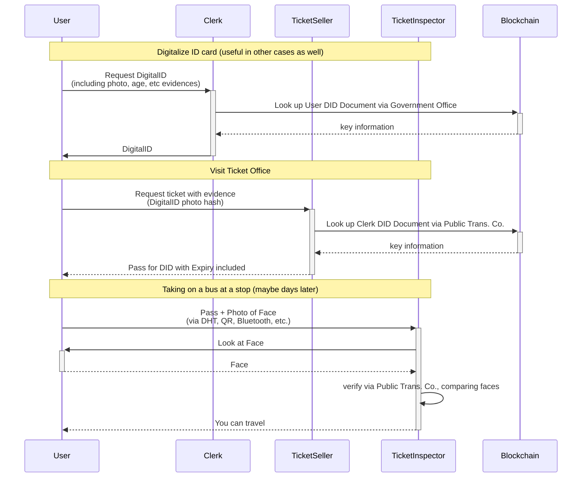

# Use Case 4: Personalized Tickets

This is an extension of Use Case No. 3, specializing on **non-transferable** tickets, e.g. buying and using a public transportation pass. 
The tickets **cannot be used by anyone else**, only by the buyer's DID.

## Solution

All the concepts of use case 3 still apply. The difference lies in the ticket itself, which should now contain a reference to the the user's DID itself, i.e. be formulated in the form of a statement.

## Scenario

1. User goes to the government office to get a digitalized ID card, meaning the user gets a digital proof about their name, address, photo, etc. 
This step is needed only once and can be used for any number of tickets or other use cases afterwards.
1. User goes to the ticket office (typically days before using the ticket) to buy a monthly ticket for public transportation. In exchange, the user receives a digital proof of ticket ownership (a statement). 
1. User goes to the subway for traveling (e.g. from home to university) holding
   - a proof of ticket ownership
   - indirect proof of control using the previously issued DigitalID
1. The inspector at the gate or on the train validates both and decides if the user can enter or not.

### Participants

- Clerk (delegate of the Government Office)
  - Witness for digital ID
- Government Office
  - digital ID Authority
- Ticket Seller (delegate of the Public Transportation Company)
  - digital ID Inspector
  - delegated ticket purchase Witness
- Ticket Inspector (delegate of the Public Transportation Company)
  - ticket purchase Inspector
  - face Verifier (offline, see later)
- Public Transportation Company
  - digital ID Verifier (when buying the ticket)
  - ticket Authority
  - ticket purchase Verifier

## Sequence Diagram

This describes the process of using a DigitalID attached to a DID to convince a third party in person (offline process) that you are in control of a DID without signing anything using your private key.

> **Note:** public transportation often uses entrance gates with automated ticket/pass validation without human inspectors. In other cases (depends heavily on the country) or maybe during a regular supervision on spot, users might still have to prove their face.
